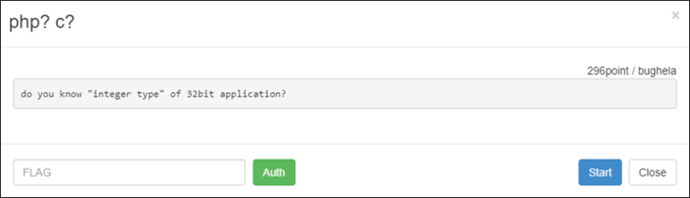

# [목차]
**1. [Description](#Description)**

**2. [Write-Up](#Write-Up)**

**3. [FLAG](#FLAG)**


***


# **Description**



# **Write-Up**

접속하면 D1, D2를 입력하라고 나온다. (좌측상단에 :p킹받네)


get source를 클릭하면 다음과 같은 코드가 나온다.

```php
<?php
    if (isset($_GET['view-source'])) {
        show_source(__FILE__);
        exit();
    }
    require("../lib.php"); // include for auth_code function.
    if(isset($_POST['d1']) && isset($_POST['d2'])){
        $input1=(int)$_POST['d1'];
        $input2=(int)$_POST['d2'];
        if(!is_file("/tmp/p7")){exec("gcc -o /tmp/p7 ./p7.c");}
        $result=exec("/tmp/p7 ".$input1);
        if($result!=1 && $result==$input2){echo auth_code("php? c?");}else{echo "try again!";}
    }else{echo ":p";}
?>
<style>
    table {background-color:#000; color:#fff;}
    td {background-color:#444;}
</style>
<hr />
    <center>
        <form method='post'>
            <table>
                <tr><td>D1:</td><td><input type='text' id="firstf" style="width:75px;" maxlength="9" name='d1'></td></tr>
                <tr><td>D2:</td><td><input type='text' style="width:75px;" name='d2'></td></tr>
                <tr><td colspan="2" style="text-align:center;"><input type='submit' value='try'></td></tr>
            </table>
        </form>
        <div><a href='?view-source'>get source</a></div>
    </center>
    <script>
        document.getElementById("firstf").focus();
    </script>
```

p7.c코드를 컴파일하여 해당 프로그램의 리턴 값과 비교하니 해당 소스를 본다. argv[1]은 d1의 int로 형변환 된 값이고, 그 값이 0 미만이여서는 안되고, +5 하였을 때, 5이상이여서도 안된다. integeroverflow를 이용하라는 문제이다.

```c
#include <stdio.h>
#include <stdlib.h>
void nono();
int main(int argc,char **argv){
    int i;
    if(argc!=2){nono();}
    i=atoi(argv[1]);
    if(i<0){nono();}
    i=i+5;
    if(i>4){nono();}
    if(i<5){printf("%d",i);}
    return 0;
}
void nono(){
    printf("%d",1);
    exit(1);
}
```

int의 최대로 가질 수 있는 값은 2147483647이다. 따라서 다음과 같은 c소스를 컴파일 후 돌려보면 D1, D2에 입력하면 되는 값이 나온다.

> [Online C Compiler](https://www.onlinegdb.com/online_c_compiler)

```c
#include <stdio.h>
int main() {
    const char *t = "2147483647";
    int i=atoi(t);
    if(i<0) return 1;
    i = i+5;
    printf("d1 is %s\n", t);
    printf("d2 is %d\n", i);
    return 0;
}

[Output]
d1 is 2147483647
d2 is -2147483644
```

d1의 maxlength가 9이기 때문에 늘려준다.


D1과 D2에 값을 넣어주면, FLAG를 획득할 수 있다.


# **FLAG**

**3bf5e8f376cb8cf89a39c6a36246a38ba2f1538a**