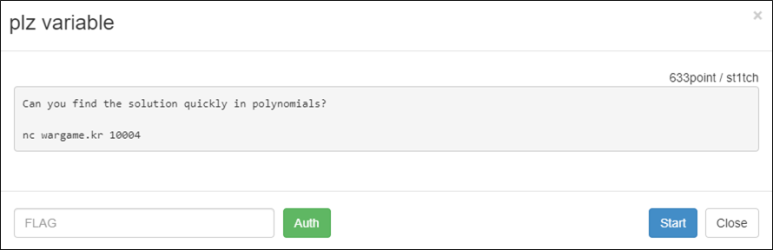
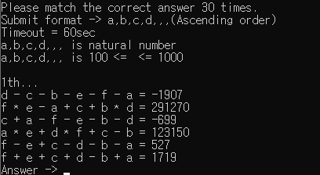

# [목차]
**1. [Description](#Description)**

**2. [Write-Up](#Write-Up)**

**3. [FLAG](#FLAG)**


***


# **Description**



# **Write-Up**

nc로 접속하면 다음과 같은 문제가 나온다.



여러개의 다항식을 통해 해를 구하는 문제이다. z3 라이브러리를 이용하여 계산하자.

```python
import z3 # pip3 install z3-solver
import re
from pwn import *

r = remote("wargame.kr", 10004)

for i in range(30):
    r.recvuntil('th...\n')
    data        = r.recvuntil('Answer ->')
    Question    = data.decode().split('\n')[:-1]
    variables   = re.findall('[a-z]', Question[0])
    solver      = z3.Solver()

    for v in variables:
        exec('{0}=z3.Int(\'{0}\')'.format(v))
        solver.add(eval('{0} >= 100'.format(v)))
        solver.add(eval('{0} <= 1000'.format(v)))
    for q in Question: solver.add(eval(q.replace('=', '==')))
    solver.check()
    model           = solver.model()

    sorted_model    = sorted([(d, model[d]) for d in model], key = lambda x: str(x[0]))
    answer          = ','.join([str(sm[1]) for sm in sorted_model])
    r.sendline(answer.encode())

r.interactive()

[Output]
[x] Opening connection to wargame.kr on port 10004
[x] Opening connection to wargame.kr on port 10004: Trying 175.207.12.40
[+] Opening connection to wargame.kr on port 10004: Done
[*] Switching to interactive mode
 

Flag is wmkr{Wow_Fuck_the_z3?!}


[*] Got EOF while reading in interactive
```

아니 Submit format -> a,b,c,d,,,(Ascending order)이러고만 써놓고, 만약 해가 a=1, b=5, c=2라면

1. 1,2,5로 보내라는 건지

2. a,c,b로 보내라는 건지

정작 보내는 포맷은 1,2,5였음

# **FLAG**

**wmkr{Wow_Fuck_the_z3?!}**