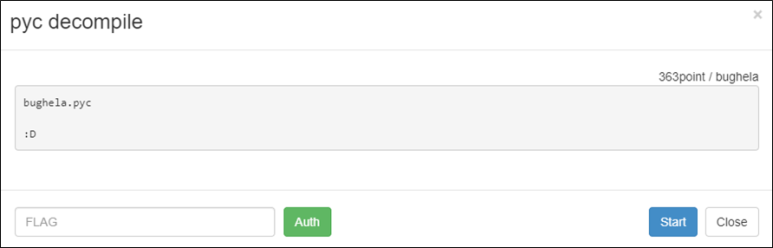
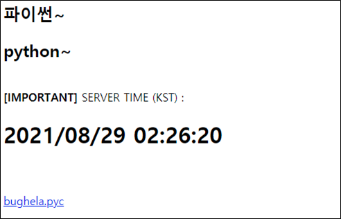
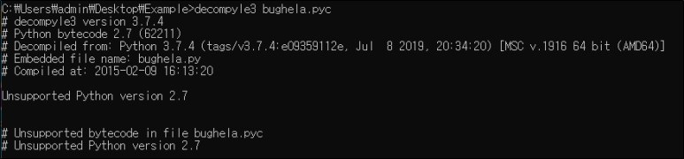

# [목차]
**1. [Description](#Description)**

**2. [Write-Up](#Write-Up)**

**3. [FLAG](#FLAG)**


***


# **Description**



# **Write-Up**

현재 서버의 시간과 pyc파일을 준다.



decompyle3으로 디컴파일을 시도하려 했지만, python2로 컴파일되었던 파일인것으로 보인다.



easy python decompiler를 사용하여 소스코드를 추출한다.

> [easy python decompiler](https://sourceforge.net/projects/easypythondecompiler/)

python 코드는 다음과 같다.

```python
import time
from sys import exit
from hashlib import sha512

def main():
    print 'import me :D'


def GIVE_ME_FLAG(flag):
    if flag[:43] != 'http://wargame.kr:8080/pyc_decompile/?flag=':
        die()
    flag = flag[43:]
    now = time.localtime(time.time())
    seed = time.strftime('%m/%d/HJEJSH', time.localtime())
    hs = sha512(seed).hexdigest()
    start = now.tm_hour % 3 + 1
    end = start * (now.tm_min % 30 + 10)
    ok = hs[start:end]
    if ok != flag:
        die()
    print 'GOOD!!!'


def die():
    print 'NOPE...'
    exit()


if __name__ == '__main__':
    main()
```

현재 시간을 이용하여 seed값을 정한고,(ex : 08/29/HJEJSH) seed를 통해서 sha512 해쉬 값을 hs에 저장한다.

```python
seed = time.strftime('%m/%d/HJEJSH', time.localtime())
hs = sha512(seed).hexdigest()
```

start는 현재 시간의 시간을 이용하여 현재시간을 3으로 나눌 몫 + 1을 저장한다. (ex: 2%3 + 1)

```python
start = now.tm_hour % 3 + 1
```

end는 현재 시간의 분을 이용한다. 이때, 접속한 페이지에서 나온 서버시간과 차이를 고려해야한다. 나는 5분 x초의 차이가 나서 now.tm_min+5로 하였다.

```python
end = start * ((now.tm_min+5) % 30 + 10)
```

그리고 flag에 전달된 인자 값을 구한다.

```python
ok = hs[start:end]
url = 'http://wargame.kr:8080/pyc_decompile/?flag='
print(url+str(ok))

[Output]
http://wargame.kr:8080/pyc_decompile/?flag=d098367ebb2e3322c3aa89eabc90608769a7d51f8091d0bda621f9297f2d67f4f0833143f1f37739802630573d43e1a40eeb2433e114a0c
```

서버에 flag값을 전달해서 서버에서 계산된 값과 맞으면 FLAG를 획득할 수 있다.


# **FLAG**

**3f03abe19adfe6080e80f9eb4f43cad64afa3463**