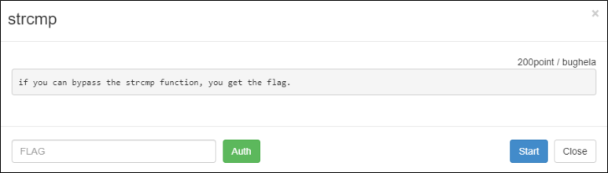
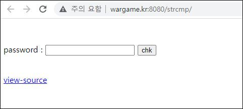
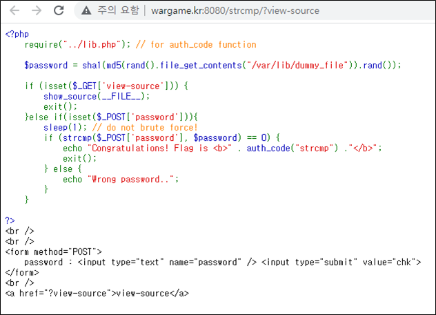
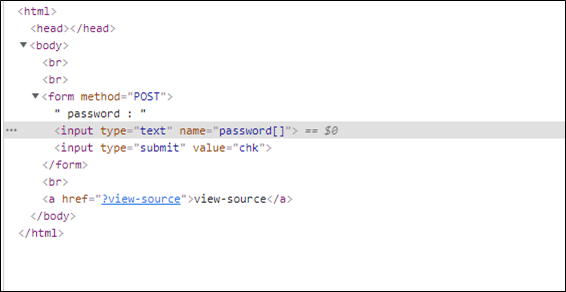
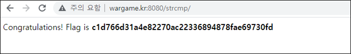

# [목차]
**1. [Description](#Description)**

**2. [Write-Up](#Write-Up)**

**3. [FLAG](#FLAG)**

***

# **Description**

# **Write-Up**

password를 입력하라고 나온다.

view-source를 클릭하면 언어는 php이고 strcmp로 password를 비교하는 걸 알 수 있다.

다음과 같은 2가지를 이용하여 password가 뭔지 몰라도 우회할 수 있다.

1. strcmp는 문자열과 array()를 인자 값으로 넣었을 때, NULL을 반환한다. (strcmp("string", array()) -> null)

> [PHP strcmp](https://www.php.net/manual/en/function.strcmp.php)

2. == 를 사용 시 null 과 0을 비교 시 True를 반환한다. (null == 0 -> true)

> [PHP Loose Comparison](https://www.php.net/manual/en/types.comparisons.php)

따라서 다음과 같이 $_POST['password']값을 array로 변환시켜준다.

그리고 chk버튼을 눌러주면 FLAG를 획득할 수 있다.

# **FLAG**

**c1d766d31a4e82270ac22336894878fae69730fd**