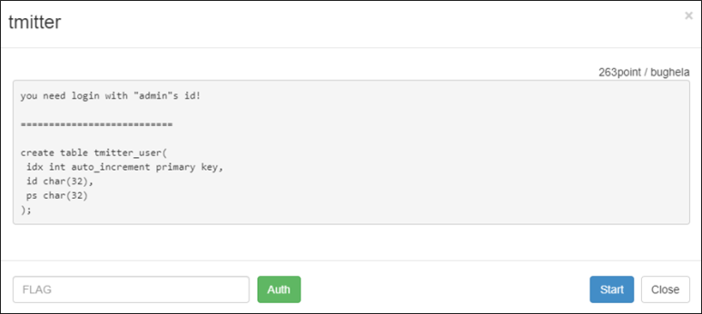
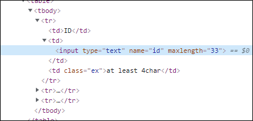
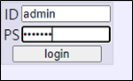
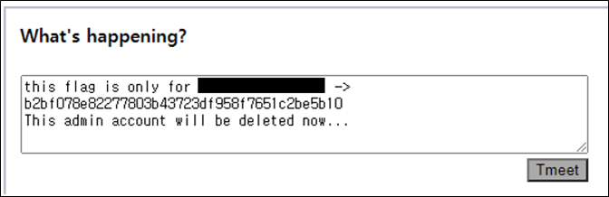

# [목차]
**1. [Description](#Description)**

**2. [Write-Up](#Write-Up)**

**3. [FLAG](#FLAG)**


***


# **Description**



# **Write-Up**

Sign in에서 admin으로 로그인 해야하나 보다.


문제에 테이블 구조에서 id 컬럼 타입이 char형태이다. 즉, insert할 때 공백을 넣으면 공백이 제거되서 들어간다.

> [Online MySQL](https://paiza.io/projects/zgSzWJ9hDUjWeHUYZ5VwVA?language=mysql)

```sql
create table Test(id integer, title char(6));
insert into Test(id, title) values(1, "Hello ");
insert into Test(id, title) values(2, "Hello");
select * from Test where title="Hello";

[Result]
id	title
1	Hello
2	Hello
```

회원가입 시 ID에서 maxlength를 33글자 이상으로 수정하고, 1을 33번 넣고 PS를 1을 7번 넣어 본 후, 로그인에서 ID에 1을 32번 넣고 PS를 1을 7번 넣어보면 로그인이 된다. 즉, 32글자까지 잘려서 insert된다.



id는 primary key가 아니기 때문에 ID에 admin 1과 같이 admin과 1 사이에 공백을 주어 33글자 이상으로 넣고, 비밀번호는 쉬운 것으로 입력하여 회원가입한다.


그러면 ID는 32글자까지 잘리고 공백은 취급안하여 admin만 입력해도 된다.



login버튼을 클릭하면 다음과 같이 FLAG를 획득할 수 있다.



# **FLAG**

**b2bf078e82277803b43723df958f7651c2be5b10**