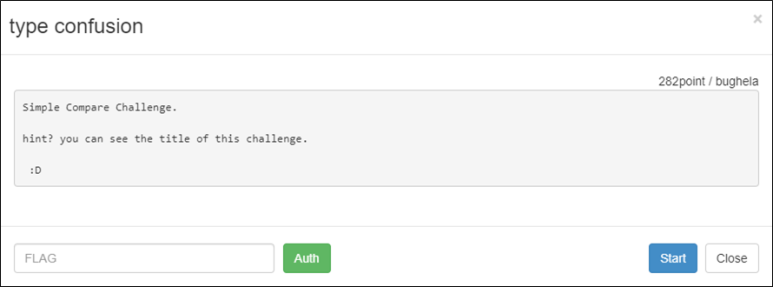
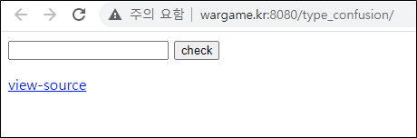
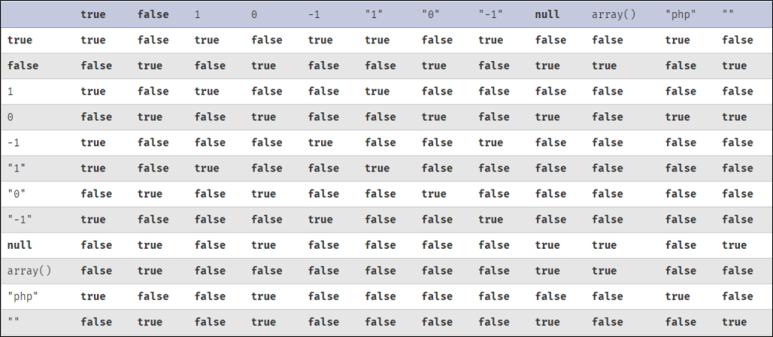
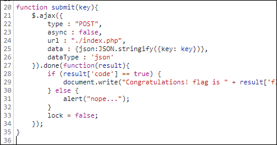
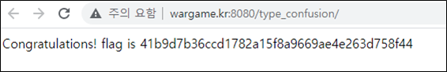

# [목차]
**1. [Description](#Description)**

**2. [Write-Up](#Write-Up)**

**3. [FLAG](#FLAG)**


***


# **Description**



# **Write-Up**

무엇인가를 입력하라고 나온다.



view-source는 참지 않는다. 클릭하면 다음과 같은 소스 코드가 주어진다.

```php
<?php
 if (isset($_GET['view-source'])) {
     show_source(__FILE__);
    exit();
 }
 if (isset($_POST['json'])) {
     usleep(500000);
     require("../lib.php"); // include for auth_code function.
    $json = json_decode($_POST['json']);
    $key = gen_key();
    if ($json->key == $key) {
        $ret = ["code" => true, "flag" => auth_code("type confusion")];
    } else {
        $ret = ["code" => false];
    }
    die(json_encode($ret));
 }

 function gen_key(){
     $key = uniqid("welcome to wargame.kr!_", true);
    $key = sha1($key);
     return $key;
 }
?>

<html>
    <head>
        <script src="//ajax.googleapis.com/ajax/libs/jquery/1.8.1/jquery.min.js"></script>
        <script src="./util.js"></script>
    </head>
    <body>
        <form onsubmit="return submit_check(this);">
            <input type="text" name="key" />
            <input type="submit" value="check" />
        </form>
        <a href="./?view-source">view-source</a>
    </body>
</html>
```

json->key == key가 true가 나와야 FLAG를 얻을 수 있다. 우선 gen_key함수의 리턴 타입은 문자열이란 것을 알 수 있다.

그렇다면, Loose comparisons with == 을 안 볼 수 가 없다.

> [PHP Loose Comparison](https://www.php.net/manual/en/types.comparisons.php)



문자열과 비교시 true, 0, 같은 문자열이면 true를 반환한다. 즉 json->key값이 true, 0, key와 같은 값들 중 하나이면 된다.

javascript를 확인하면 submit함수에 parameter를 넣는 값이 json형식으로 데이터를 넘긴다.



chrome 개발자 도구 Console탭에서 submit(true) 혹은 submit(0)을 입력 후 엔터치면 FLAG를 획득할 수 있다.



# **FLAG**

**41b9d7b36ccd1782a15f8a9669ae4e263d758f44**