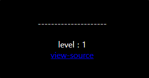
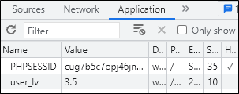
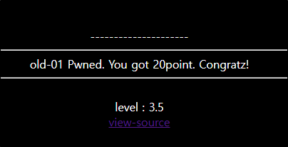

# [목차]
**1. [Description](#Description)**

**2. [Write-Up](#Write-Up)**


***


# **Description**




# **Write-Up**

view-source를 보면 $_COOKE['user_lv']이 3초과 4이하면 solve(1)을 호출하여 문제가 풀리는 것으로 보인다.

```php
<?php
  include "../../config.php";
  if($_GET['view-source'] == 1){ view_source(); }
  if(!$_COOKIE['user_lv']){
    SetCookie("user_lv","1",time()+86400*30,"/challenge/web-01/");
    echo("<meta http-equiv=refresh content=0>");
  }
?>
<html>
<head>
<title>Challenge 1</title>
</head>
<body bgcolor=black>
<center>
<br><br><br><br><br>
<font color=white>
---------------------<br>
<?php
  if(!is_numeric($_COOKIE['user_lv'])) $_COOKIE['user_lv']=1;
  if($_COOKIE['user_lv']>=4) $_COOKIE['user_lv']=1;
  if($_COOKIE['user_lv']>3) solve(1);
  echo "<br>level : {$_COOKIE['user_lv']}";
?>
<br>
<a href=./?view-source=1>view-source</a>
</body>
</html>
```

실수형으로 설정하여 조건을 만족시켜주자.



페이지를 새로고침하면 점수를 획득할 수 있다.

