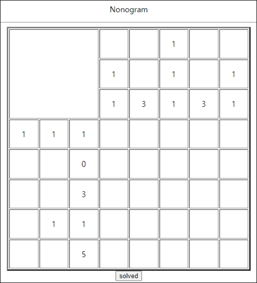
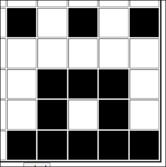
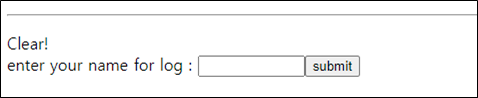
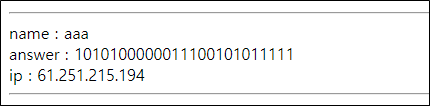
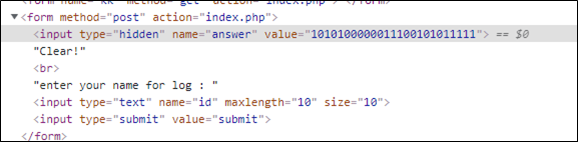
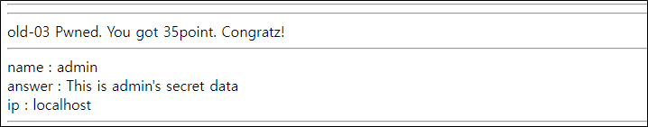

# [목차]
**1. [Description](#Description)**

**2. [Write-Up](#Write-Up)**

***

# **Description**

# **Write-Up**

우측 하단을 클릭하면 검은색으로 바뀐다. 숫자만큼 검은색을 채우면 다음과 같은 도형이 만들어진다.

이후 solved를 클릭하면 GET method로 색칠된 값을 보내고, 클리어했다고 나온다.

name값을 아무거나 입력해보면 로그가 기록된다. (한글 입력 안됨)

Clear페이지에서 조작할 수 있는 값은 두가지가 있다.

answer값에 ' or 1=1 #을 넘기면 ip가 localhost인것이 뽑히는 지 admin으로 인식하여 점수를 획득할 수 있다.

