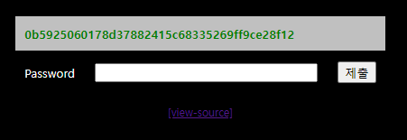

# [목차]
**1. [Description](#Description)**

**2. [Write-Up](#Write-Up)**


***


# **Description**




# **Write-Up**

view-source를 클릭하면 Password로 입력된 값과 500번의 sha1 해시함수를 거치기 전의 값과 비교하여 맞다면 점수를 획득할 수 있다는 것을 확인할 수 있다.

```php
<?php
  include "../../config.php";
  if($_GET['view-source'] == 1) view_source();
?><html>
<head>
<title>Challenge 4</title>
<style type="text/css">
body { background:black; color:white; font-size:9pt; }
table { color:white; font-size:10pt; }
</style>
</head>
<body><br><br>
<center>
<?php
  sleep(1); // anti brute force
  if((isset($_SESSION['chall4'])) && ($_POST['key'] == $_SESSION['chall4'])) solve(4);
  $hash = rand(10000000,99999999)."salt_for_you";
  $_SESSION['chall4'] = $hash;
  for($i=0;$i<500;$i++) $hash = sha1($hash);
?><br>
<form method=post>
<table border=0 align=center cellpadding=10>
<tr><td colspan=3 style=background:silver;color:green;><b><?=$hash?></b></td></tr>
<tr align=center><td>Password</td><td><input name=key type=text size=30></td><td><input type=submit></td></tr>
</table>
</form>
<a href=?view-source=1>[view-source]</a>
</center>
</body>
</html>
```

문제에서 주어지는 hash값은 새로고침할 때마다 새로 생성되므로, 바로바로 crack하기 보다는 bruteforce의 일종인 rainbow-table을 제작하여야 한다.

```python
from hashlib import sha1
import threading

def work(id,start):
    f = open("sha1_"+str(id)+".txt", 'w')
    for i in range(start*id, start*(id+1)):
        key = str(i)+"salt_for_you"
        data = key
        for k in range(0,500): key = sha1(key.encode('utf-8')).hexdigest()
        data = data + " - " + key + "\n"
        f.write(data)
    f.close()
    return

if __name__ == "__main__":
    start   = 10000000
    result  = []
    threads = []
    for i in range(1, 10):
        th = threading.Thread(target=work, args=(i, start))
        th.start()
        threads.append(th)
    for th in threads: th.join()
```

얼추 데이터가 쌓였다 싶으면 해시 값을 찾아보자.


원본 데이터를 Password로 입력하면 점수를 획득할 수 있다.

