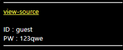

# [목차]
**1. [Description](#Description)**

**2. [Write-Up](#Write-Up)**


***


# **Description**




# **Write-Up**

view-source를 클릭하면 소스코드를 볼 수 있고, 8번의 문자열 치환과 20번의 base64 디코딩을 거쳐서 id와 pw가 각각 admin, nimda가 되면 점수를 획득할 수 있을 것이라고 보인다.

```php
... 생략 ...
<?php
$decode_id=$_COOKIE['user'];
$decode_pw=$_COOKIE['password'];

$decode_id=str_replace("!","1",$decode_id);
$decode_id=str_replace("@","2",$decode_id);
$decode_id=str_replace("$","3",$decode_id);
$decode_id=str_replace("^","4",$decode_id);
$decode_id=str_replace("&","5",$decode_id);
$decode_id=str_replace("*","6",$decode_id);
$decode_id=str_replace("(","7",$decode_id);
$decode_id=str_replace(")","8",$decode_id);

$decode_pw=str_replace("!","1",$decode_pw);
$decode_pw=str_replace("@","2",$decode_pw);
$decode_pw=str_replace("$","3",$decode_pw);
$decode_pw=str_replace("^","4",$decode_pw);
$decode_pw=str_replace("&","5",$decode_pw);
$decode_pw=str_replace("*","6",$decode_pw);
$decode_pw=str_replace("(","7",$decode_pw);
$decode_pw=str_replace(")","8",$decode_pw);

for($i=0;$i<20;$i++){
  $decode_id=base64_decode($decode_id);
  $decode_pw=base64_decode($decode_pw);
}

echo("<hr><a href=./?view_source=1 style=color:yellow;>view-source</a><br><br>");
echo("ID : $decode_id<br>PW : $decode_pw<hr>");

if($decode_id=="admin" && $decode_pw=="nimda"){
  solve(6);
}
?>
... 생략 ...
```

쿠키에서 점수를 얻기 위해 PHP Session값을 붙혀넣고 다음과 같은 python script를 통해서 점수를 획득하자.

```python
import base64
import urllib.request

id  = b'admin'
pw  = b'nimda'
for i in range(20): id  = base64.b64encode(id)
for i in range(20): pw  = base64.b64encode(pw)
id  = id.decode()
pw  = pw.decode()
id  = id.replace("1","!").replace("2","@").replace("3","$").replace("4","^").replace("5","&").replace("6","*").replace("7","(").replace("8",")")
pw  = pw.replace("1","!").replace("2","@").replace("3","$").replace("4","^").replace("5","&").replace("6","*").replace("7","(").replace("8",")")
id  = urllib.parse.quote(id)
pw  = urllib.parse.quote(pw)

url = 'https://webhacking.kr/challenge/web-06/'
request = urllib.request.Request(url)
request.add_header('Cookie', 'PHPSESSID=ugnq10n0fut358i5tagev9ko4e;user='+id+';password='+pw)
response= urllib.request.urlopen(request)
print(response.read().decode())

[Output]
<html>
<head>
<title>Challenge 6</title>
<style type="text/css">
body { background:black; color:white; font-size:10pt; }
</style>
</head>
<body>
<hr><a href=./?view_source=1 style=color:yellow;>view-source</a><br><br>ID : admin<br>PW : nimda<hr><script>alert('old-06 Pwned!');</script><hr>old-06 Pwned. You got 10point. Congratz!<hr></body>
</html>
```