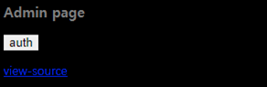
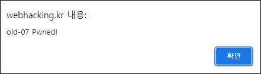
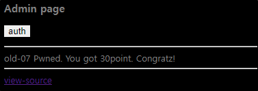
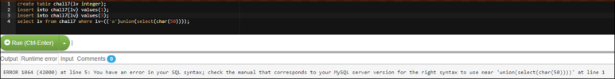

# [목차]
**1. [Description](#Description)**

**2. [Write-Up](#Write-Up)**


***


# **Description**




# **Write-Up**

view-source를 누르면 쿼리의 결과가 2가 나와야 점수를 획득할 것으로 보이고, 2라는 값은 preg_match로 필터링된다.

```python
... 생략 ...
if(preg_match("/2|-|\+|from|_|=|\\s|\*|\//i",$go)) exit("Access Denied!");
... 생략 ...
elseif($data[0]==2){
  echo("<input type=button style=border:0;bgcolor='gray' value='auth' onclick=\"alert('Hello admin')\"><p>");
  solve(7);
}
... 생략 ...
```

char함수를 이용하여 val에 char(50)넣으면 query error구문으로 간다. 즉, lv컬럼의 2라는 값은 존재하지 않는다.


공백(\s) 필터링을 우회하면서 union과 select로 조합하여 'a')union(select(char(50))을 val에 넣어보면, 4/5 확률로 nice try가 출력된다.


괄호가 맞지 않아서 생기는 쿼리 에러이기 때문이다. 따라서, rand가 1이 될때까지 반복하자.



점수를 획득할 수 있다.



rand가 2이상이면 괄호 수가 맞더라도 쿼리 에러가 난다. lv='a'와 union이 되어야하는데, lv=(('a')union)가 되버리기 때문이다.

> [Online MySQL](https://paiza.io/projects/9feo__HXU4ybkAkv6qa8yA?language=mysql)

