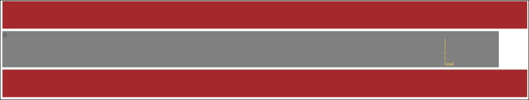
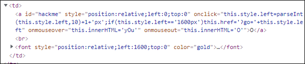
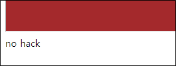
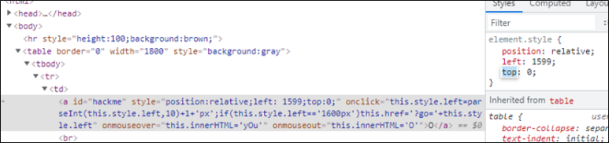
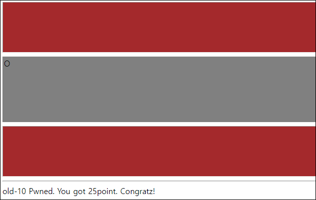

# [목차]
**1. [Description](#Description)**

**2. [Write-Up](#Write-Up)**

***

# **Description**

# **Write-Up**

O라고 써져있는 부분의 소스를 보면 클릭 시 left.속성의 값이 +1px이 되고, left 속성의 값이 1600px이 되면 링크가 생성되며 go 변수에 left 속성의 값을 저장하여 GET method로 전송한다.

그래서 go에 1600px를 넘겨 접근하면 no hack이라고 나온다.

그러면 Google DevTools를 이용하여 left값을 1599로 바꾸자.

그리고 글씨를 클릭하면, 점수를 얻을 수 있다.

