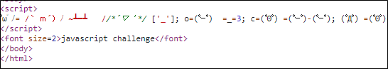
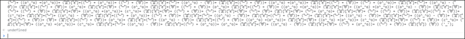
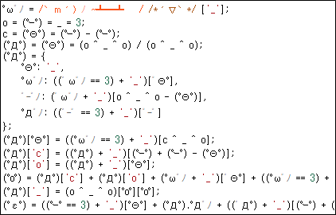
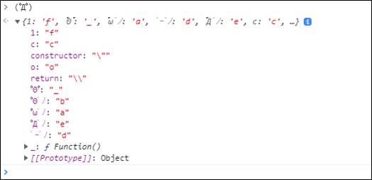
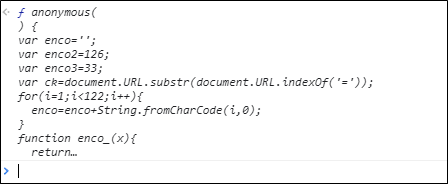
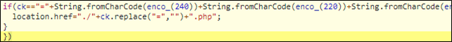
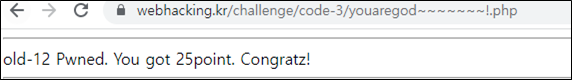

# [목차]
**1. [Description](#Description)**

**2. [Write-Up](#Write-Up)**

**3. [FLAG](#FLAG)**


***


# **Description**


# **Write-Up**

javascript challenge라고 한다. 소스 보자.



전체 복사해서 한번 실행 시켜보자.

* 보기 싫은 표정이 매우 다양하다.



개행문자를 통해 그래도 해석해보려고 노력해보면 (ﾟДﾟ)는 function이나 class이거 한것 같다.

> [JS 자동 정렬](https://beautifier.io/)



(ﾟДﾟ)만 실행해보면 들어가 있는 값들이 있다.



맨 마지막 라인을 보면 ('_')라는 값을 인자로 넣는 것 같다.

```javascript
... 생략 ... (ﾟДﾟ)[ﾟεﾟ]+(ﾟΘﾟ)+ ((ﾟｰﾟ) + (o^_^o))+ ((ﾟｰﾟ) + (ﾟΘﾟ))+ (ﾟДﾟ)[ﾟoﾟ]) (ﾟΘﾟ)) ('_');
```

따라서 ('_')만 제외하고 첫번째 라인부터 전부 복사해서 붙혀넣어보면 표정은 안봐도 된다.



결과를 클릭하면 모든 소스가 출력되고, 최종 난독화를 해제해야 하는 부분은 ck와 비교하는 부분이다.



해석할 필요 없다. console.log(조건)만 anonymous 함수안에 넣어주고, call만 해주면 뭐랑 비교하는 지 알 수 있다.

```javascript
function anonymous()
{
    var enco='';
    var enco2=126;
    var enco3=33;
    var ck=document.URL.substr(document.URL.indexOf('='));
    for(i=1;i<122;i++){
        enco=enco+String.fromCharCode(i,0);
    }
    function enco_(x){
        return enco.charCodeAt(x);
    }
    console.log(String.fromCharCode(enco_(240))+String.fromCharCode(enco_(220))+String.fromCharCode(enco_(232))+String.fromCharCode(enco_(192))+String.fromCharCode(enco_(226))+String.fromCharCode(enco_(200))+String.fromCharCode(enco_(204))+String.fromCharCode(enco_(222-2))+String.fromCharCode(enco_(198))+"~~~~~~"+String.fromCharCode(enco2)+String.fromCharCode(enco3));
    if(ck=="="+String.fromCharCode(enco_(240))+String.fromCharCode(enco_(220))+String.fromCharCode(enco_(232))+String.fromCharCode(enco_(192))+String.fromCharCode(enco_(226))+String.fromCharCode(enco_(200))+String.fromCharCode(enco_(204))+String.fromCharCode(enco_(222-2))+String.fromCharCode(enco_(198))+"~~~~~~"+String.fromCharCode(enco2)+String.fromCharCode(enco3))
    {
        location.href="./"+ck.replace("=","")+".php";
    }
}
anonymous()
youaregod~~~~~~~!
```

조건문에 ck값이 php파일명임을 알 수 있으니 접근하면 점수를 획득할 수 있다.

