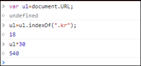

# [목차]
**1. [Description](#Description)**

**2. [Write-Up](#Write-Up)**


***


# **Description**


# **Write-Up**

javascript 코드를 보면 .kr이 위치한 index에 30을 곱하면 pw값이 나온다.

```javascript
function ck(){
  var ul=document.URL;
  ul=ul.indexOf(".kr");
  ul=ul*30;
  if(ul==pw.input_pwd.value) { location.href="?"+ul*pw.input_pwd.value; }
  else { alert("Wrong"); }
}
```

chrome DevTools를 이용하여 pw값을 구하자



540값을 넣으면 점수를 획득할 수 있다.

