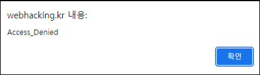
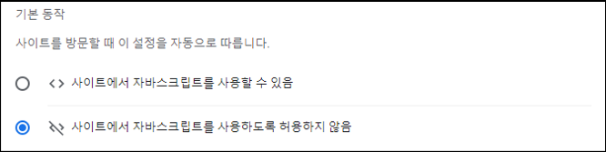

# [목차]
**1. [Description](#Description)**

**2. [Write-Up](#Write-Up)**


***


# **Description**




# **Write-Up**

문제 페이지에 접근하면 alert로 Access_Denied라고 나온다. javascript를 비활성화 하자. (chrome 기준 설명)



비활성화 이후 다시 접근하면 빈 화면이고 소스를 보면 javascript를 확인할 수 있다.

```javascript
  alert("Access_Denied");
  location.href='/';
  document.write("<a href=?getFlag>[Get Flag]</a>");
```

적힌 url로 접근하면 점수를 획득할 수 있다.