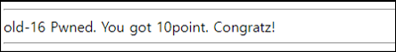

# [목차]
**1. [Description](#Description)**

**2. [Write-Up](#Write-Up)**


***


# **Description**


# **Write-Up**

javascript를 보면 event.keyCode가 124일때 php파일명을 하나 알려준다.

```javascript
document.body.innerHTML+="<font color=yellow id=aa style=position:relative;left:0;top:0>*</font>";
function mv(cd){
  kk(star.style.left-50,star.style.top-50);
  if(cd==100) star.style.left=parseInt(star.style.left+0,10)+50+"px";
  if(cd==97) star.style.left=parseInt(star.style.left+0,10)-50+"px";
  if(cd==119) star.style.top=parseInt(star.style.top+0,10)-50+"px";
  if(cd==115) star.style.top=parseInt(star.style.top+0,10)+50+"px";
  if(cd==124) location.href=String.fromCharCode(cd)+".php"; // do it!
}
function kk(x,y){
  rndc=Math.floor(Math.random()*9000000);
  document.body.innerHTML+="<font color=#"+rndc+" id=aa style=position:relative;left:"+x+";top:"+y+" onmouseover=this.innerHTML=''>*</font>";
}
```

keycode 표를 보면 124는 F13(Print Screen)으로 나와있지만, 눌러도 아무 반응이 없었다.

> [KeyCode table](https://developer.mozilla.org/en-US/docs/Web/API/KeyboardEvent/keyCode)


그래서 console을 통해 값을 알아봤다.


해당 파일에 접근하면 점수를 획득할 수 있다.

