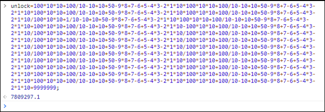
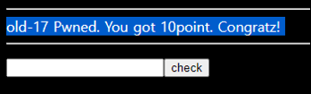

# [목차]
**1. [Description](#Description)**

**2. [Write-Up](#Write-Up)**

***


# **Description**


# **Write-Up**

javascript를 보면 unlock값이 매우 긴 연산의 결과로 저장된다.

```javascript
unlock=100*10*10+100/10-10+10+50-9*8+7-6+5-4*3-2*1*10*100*10*10+100/10-10+10+50-9*8+7-6+5-4*3-2*1*10*100*10*10+100/ ......
... 생략 ...
```

복사 붙혀넣기를 하여 Console창에서 결과를 확인하자.



결과 값을 넣고 check버튼을 클릭하면 점수를 획득할 수 있다.

