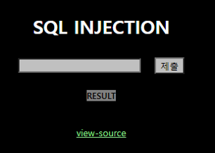
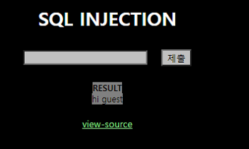
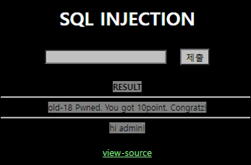

# [목차]
**1. [Description](#Description)**

**2. [Write-Up](#Write-Up)**


***


# **Description**




# **Write-Up**

view-source를 클릭하여 보면 $result['id']값이 admin이면 점수를 획득할 수 있다.

```php
<?php
if($_GET['no']){
  $db = dbconnect();
  if(preg_match("/ |\/|\(|\)|\||&|select|from|0x/i",$_GET['no'])) exit("no hack");
  $result = mysqli_fetch_array(mysqli_query($db,"select id from chall18 where id='guest' and no=$_GET[no]")); // admin's no = 2

  if($result['id']=="guest") echo "hi guest";
  if($result['id']=="admin"){
    solve(18);
    echo "hi admin!";
  }
}
?>
```

no를 1로 넣으면 hi guest가 출력되는 것으로 보아 guest의 no는 1이다.



따라서 0 or no=2를 넣으면 id='guest' and no=0이 되어서 값이 안나오고, admin의 no가 2라고 했으니 id는 2가 나올 것이다.

다만, 공백(space)가 필터링 되므로 %0a, %0d같은 것으로 우회하자.


%0d는 이미 url encoding이 된 상태이다. 따라서 input 태그에 넣으면 %가 다시 url encoding이 되므로, url에 직접 입력하면 점수를 획득할 수 있다.

