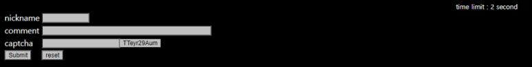
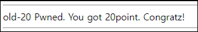

# [목차]
**1. [Description](#Description)**

**2. [Write-Up](#Write-Up)**


***


# **Description**




# **Write-Up**

상단에 보면 2초라고 되어있는데, 모든 input값을 적고 Submit까지 2초안으로 해결해야하는 문제같다.

captcah값은 매번 달라지는 듯 하다.

```html
... 생략 ...
<input type=button name=captcha_ value="xgZBWD1Lol" style="border:0;background=lightgreen">
... 생략 ...
```

python script를 짜서 돌려봤지만, 계속 Too Slow라고 한다.

```python
import urllib.request
from bs4 import BeautifulSoup

url     = 'https://webhacking.kr/challenge/code-4/'
header  = {'Cookie':'PHPSESSID=l7ql6t9himbquio8gdh5s61f22;st=1635301305'}
request = urllib.request.Request(url, headers=header)
response= urllib.request.urlopen(request)
result  = response.read().decode()
soup    = BeautifulSoup(result, "html.parser")
captcha = soup.find('input', {'name':'captcha_'}).get('value')

data    = urllib.parse.urlencode({'id':'hello', 'cmt':'world', 'captcha':captcha}).encode()
request = urllib.request.Request(url, headers=header, data=data)
response= urllib.request.urlopen(request)
print(response.read().decode())

[Output]
Too Slow...<meta http-equiv=refresh content=3>
```

그렇다면 javascript를 직접 입력하자. 페이지를 새로고침하자 마자 다음과 같은 script를 Console에 입력하여 엔터를 치자.

```javascript
lv5frm.id.value="hello"
lv5frm.cmt.value="world"
lv5frm.captcha.value=lv5frm.captcha_.value
lv5frm.submit()
```

점수를 획득할 수 있다.

