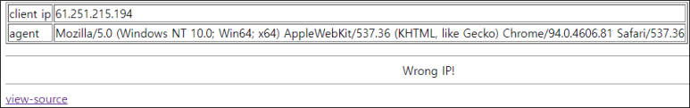
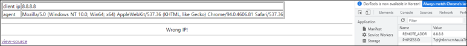
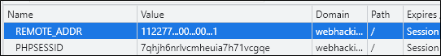
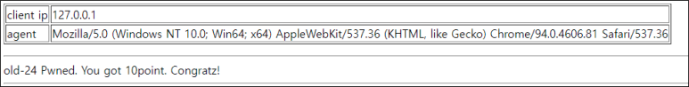

# [목차]
**1. [Description](#Description)**

**2. [Write-Up](#Write-Up)**


***


# **Description**




# **Write-Up**

view-source를 보면 ip변수가 127.0.0.1이 되어야 점수를 획득할 수 있을 거라고 추측된다.

```php
... 생략 ...
<?php
  extract($_SERVER);
  extract($_COOKIE);
  $ip = $REMOTE_ADDR;
  $agent = $HTTP_USER_AGENT;
  if($REMOTE_ADDR){
    $ip = htmlspecialchars($REMOTE_ADDR);
    $ip = str_replace("..",".",$ip);
    $ip = str_replace("12","",$ip);
    $ip = str_replace("7.","",$ip);
    $ip = str_replace("0.","",$ip);
  }
  if($HTTP_USER_AGENT){
    $agent=htmlspecialchars($HTTP_USER_AGENT);
  }
  echo "<table border=1><tr><td>client ip</td><td>{$ip}</td></tr><tr><td>agent</td><td>{$agent}</td></tr></table>";
  if($ip=="127.0.0.1"){
    solve(24);
    exit();
  }
  else{
    echo "<hr><center>Wrong IP!</center>";
  }
?>
... 생략 ...
```

extract함수를 사용하고 있으므로 REMOTE_ADDR값을 조작할 수 있을 거라고 본다. 이때 COOKIE를 이용하면 될 것 같다.



REMOTE_ADDR값을 변조 시킬 수 있다는 것이 검증되었으니 str_replace 로직을 파악하여 역연산하면, ip값은 112277...00...00...1이 되어야 결과가 127.0.0.1이 된다.

Cookie값에 REMOTE_ADDR에 112277...00...00...1을 넣고 새로고침하자.



점수를 획득할 수 있다.

