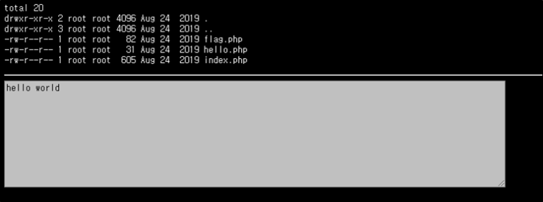
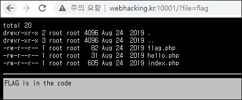
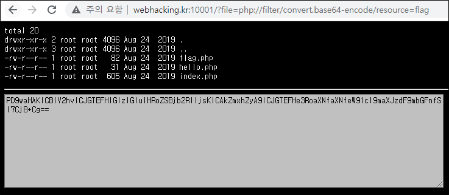
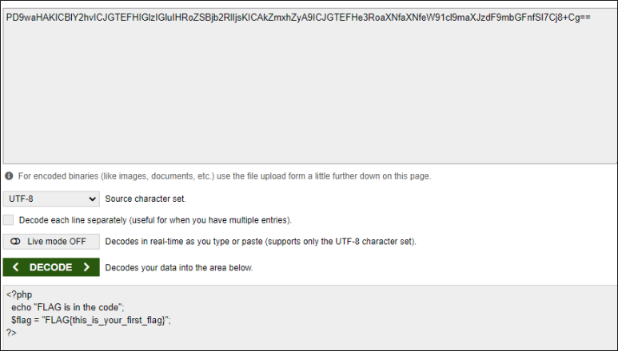
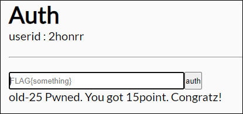

# [목차]
**1. [Description](#Description)**

**2. [Write-Up](#Write-Up)**

**3. [FLAG](#FLAG)**

***

# **Description**

# **Write-Up**

URL에서 인자 값을 보면 확장자를 제외한 파일을 출력하는 것으로 유추된다. 경험상 PHP의 include 함수를 사용하는 것으로 보인다.

PHP의 filter기능을 이용하여 LFI를 시도하면 파일의 소스를 확인할 수 있다.

결과는 base64로 인코딩되어 있고, 이를 디코딩하면 평문을 얻을 수 있다.

> [base64](https://www.base64decode.org/)

FLAG를 입력하여 점수를 획득하자.

# **FLAG**

**FLAG{this_is_your_first_flag}**