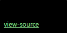
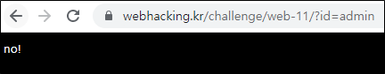
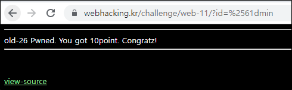

# [목차]
**1. [Description](#Description)**

**2. [Write-Up](#Write-Up)**


***


# **Description**




# **Write-Up**

view-source를 보면 id를 urldecoding한 값이 admin이면 점수를 획득할 수 있다.

```php
<?php
  if(preg_match("/admin/",$_GET['id'])) { echo"no!"; exit(); }
  $_GET['id'] = urldecode($_GET['id']);
  if($_GET['id'] == "admin"){
    solve(26);
  }
?>
```

a만 URL encoding한 %61dmin을 전달하려고 했지만 브라우저가 강제로 a로 변경하여서 안됐다.



%61을 한번더 URL encoding시켜보면 점수를 획득할 수 있다.

