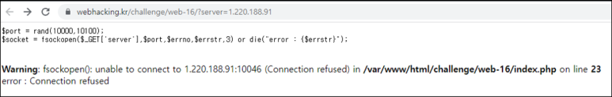
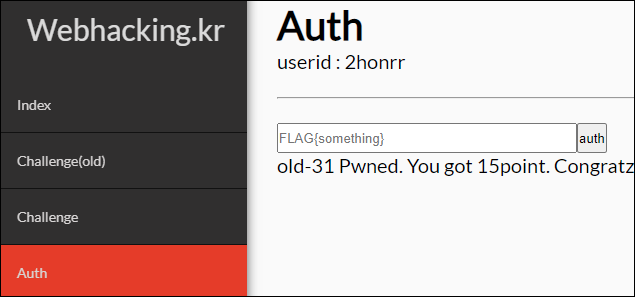

# [목차]
**1. [Description](#Description)**

**2. [Write-Up](#Write-Up)**

**3. [FLAG](#FLAG)**


***


# **Description**




# **Write-Up**

10000 ~ 10100까지 숫자 한개를 골라 소켓 접속을 시도한다. 그렇다면 모두 대기 시켜주자

```python
import socket
import threading

def run(port):
    s   = socket.socket(socket.AF_INET, socket.SOCK_STREAM)
    try:
        s.setsockopt(socket.SOL_SOCKET, socket.SO_REUSEADDR, 1)
        s.bind(('0.0.0.0', port))
        s.listen();
        client, _ = s.accept();
        data = client.recv(4096)
        print('data : {}'.format(data.decode()))
    except Exception as e: print('except : {}'.format(e))
    s.close();

for i in range(10000, 10101):
    th = threading.Thread(target=run, args=(i,))
    th.start();

th.join();
```

포트 포워딩 이후 페이지를 새로고침해주면, FLAG를 획득할 수 있다.

    data : GET /FLAG{i_have_a_big_and_beautiful_server} HTTP/1.0
    Host: 61.251.215.194

FLAG를 인증하여 점수를 획득하자.




# **FLAG**

**FLAG{i_have_a_big_and_beautiful_server}**