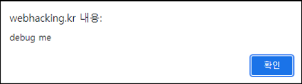
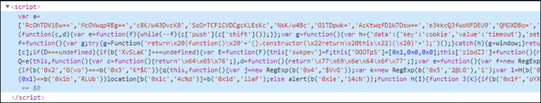
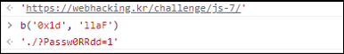

# [목차]
**1. [Description](#Description)**

**2. [Write-Up](#Write-Up)**


***


# **Description**




# **Write-Up**

js가 난독화 되어있다.



이쁘게 펴주자.

> [JS 자동 정렬](https://beautifier.io/)

밑 부분에 if else 구문이 있다. else구문의 alert가 debug me를 띄운다.

```javascript
... 생략 ...
if (location[b('0x19', 'iUmC')][b('0x1a', '6]r1')](0x1) == b('0x1b', 'RLUb'))
    location[b('0x1c', '4c%d')] = b('0x1d', 'llaF');
else
    alert(b('0x1e', '14cN'));
... 생략 ...
```

if 문의 조건이 참일 때 어떤 값이 되는 지 개발자 도구로 확인해 보자.



GET Method로 데이터를 전송하여 점수를 획득하자.