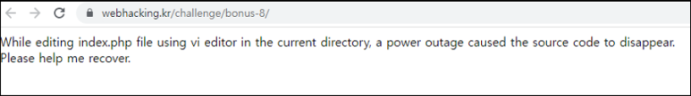
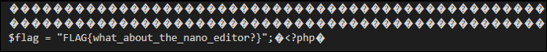
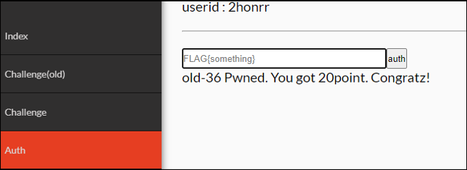

# [목차]
**1. [Description](#Description)**

**2. [Write-Up](#Write-Up)**

**3. [FLAG](#FLAG)**

***

# **Description**

# **Write-Up**

정전으로 index.php가 날라갔다고 한다. ".index.php.swp"으로 접근하여서 파일을 다운받은 후 열어보면 FLAG를 획득할 수 있다.

FLAG를 넣어 점수를 획득하자.

# **FLAG**

**FLAG{what_about_the_nano_editor?}**