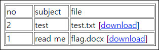
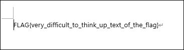

# [목차]
**1. [Description](#Description)**

**2. [Write-Up](#Write-Up)**

**3. [FLAG](#FLAG)**

***

# **Description**

# **Write-Up**

test.txt를 다운로드해보면 다음과 같은 내용이 있다.

    test123
    qwer123
    asdf234

flag.docx는 access denied 메세지가 나온다.

test.txt의 download링크를 보면 test.txt의 base64로 인코딩된 값임을 알 수 있다.

따라서 flag.docx를base64인코딩하여 ?down=ZmxhZy5kb2N4을 넘겨주면 flag.docx를 다운받을 수 있다.

다운받은 후 파일을 열어보면 FLAG를 획득할 수 있다.

FLAG를 인증하여 점수를 획득하자.

# **FLAG**

**FLAG{very_difficult_to_think_up_text_of_the_flag}**